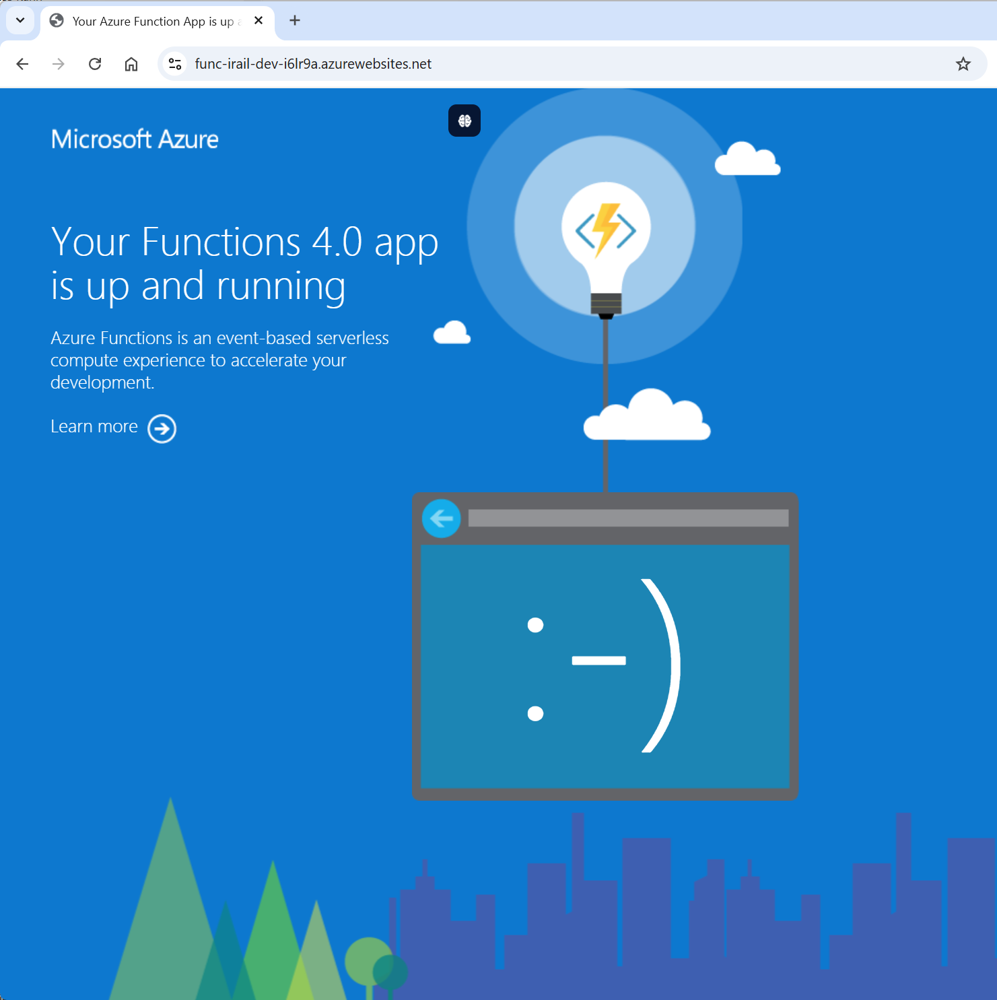

# Azure DevOps CI/CD Configuration

## Overview
This directory contains the complete CI/CD configuration for deploying your Azure Functions project with Y1 (Consumption Plan) to Azure using DevOps pipelines.

## Current Status
- Infrastructure Deployed: Y1 Consumption Plan in France Central
- Function App: `func-irail-dev-i6lr9a` (Running)
- Database: SQL Server with automated data collection
- Data Factory: Automated pipelines every 5 minutes
- Monitoring: Application Insights + Log Analytics

## Structure
```
Azure-DevOps-CICD/
├── azure-pipelines.yml          # Main pipeline configuration
├── README.md                    # This documentation file
├── variable-groups/             # Variable Groups configuration
├── service-connections/         # Service Connections setup guide
└── scripts/                     # Utility scripts
```

## Environment Strategy

### Current Deployment (Staging/Dev)
- **Purpose**: Development and testing
- **Plan Type**: Y1 (Consumption Plan) - Most cost-effective
- **Function App**: `func-irail-dev-i6lr9a`
- **Resource Group**: `rg-irail-dev-i6lr9a`
- **URL**: https://func-irail-dev-i6lr9a.azurewebsites.net
- **Region**: France Central
- **Runtime**: Python 3.12
- **Timeout**: 5 minutes (Y1 limit)
- **Subscription**: Azure for Students

### Production Environment (Future)
- Purpose: Live production workload
- Plan Type: Y1 or Y2 (depending on needs)
- Function App: func-irail-production-{random-suffix}
- Resource Group: rg-irail-production-{random-suffix}
- URL: https://func-irail-production-{random-suffix}.azurewebsites.net
- Deployment: Manual approval required

Note: The `{random-suffix}` is automatically generated by Terraform (currently `b7m2sk`) to ensure global uniqueness across all Azure subscriptions.

## Resource Naming Strategy

### Why This Naming Approach?
- Global Uniqueness: Azure requires globally unique names for many resources
- Consistent Pattern: All resources follow the same naming convention
- Automatic Generation: Terraform's random_string resource automatically generates unique suffixes
- Environment Separation: Clear distinction between environments
- Reasonable Length: Keeps names within Azure's length limits
- Easy Cleanup: Resources can be easily identified and cleaned up by environment

### Current Resource Names (Deployed)
```
# Current deployment with suffix "i6lr9a"
Function App: func-irail-dev-i6lr9a
Resource Group: rg-irail-dev-i6lr9a
SQL Server: sql-irail-dev-i6lr9a
Storage Account: stiraildevi6lr9a
Key Vault: kv-irail-dev-i6lr9a
Data Factory: df-irail-data-pobm4m
URL: https://func-irail-dev-i6lr9a.azurewebsites.net

# Future environments:
Production: func-irail-production-{new-suffix}
```

## Quick Start (Current Setup)

### Current Deployment Commands
```bash
# Deploy infrastructure and functions (Y1 plan)
./scripts/teraform-deploy-staging-Y1.sh

# Deploy Function App code
./scripts/deploy-irail-functions.sh

# Test endpoints
python scripts/test_all_endpoints_local.py

# Check deployment status
cd infrastructure
terraform output
```

### About the Y1 (Consumption) plan

The Y1 plan is the Azure Functions Consumption plan SKU. It provides a serverless, cost-efficient execution model suitable for development, testing, and low-to-moderate traffic workloads.

Key characteristics:
- Billing: Pay per execution, execution time, and memory (GB-s). No fixed monthly instance cost.
- Scaling: Automatic, event-driven horizontal scale. Instances are added/removed based on load.
- Cold starts: Functions may experience cold starts after periods of inactivity.
- Time limits: Default function timeout is 5 minutes for HTTP requests (configurable up to 10 minutes via host.json). For longer-running tasks, use Flex Consumption (FC1) or Premium.
- Platform: Linux Consumption with ephemeral file system; features like WEBSITE_TIME_ZONE/TZ are not supported.
- Always On: Not available on Consumption; use FC1 or Premium for Always On behavior.

When to use Y1:
- Development and staging environments.
- Cost-sensitive scenarios with bursty or infrequent traffic.
- Workloads that can tolerate cold starts and short execution windows.

Alternatives:
- FC1 (Flex Consumption): Faster scaling, reduced cold starts, better for production serverless.
- Premium (EP1+): Always On, VNET integration at scale, higher throughput, longer timeouts.

### Current Endpoints
- Base URL: https://func-irail-dev-i6lr9a.azurewebsites.net
- Health: `/api/health`
- Stations: `/api/stations`
- Liveboard: `/api/liveboard`
- Analytics: `/api/analytics`
- PowerBI Data: `/api/powerbi`
- Collect Data: `/api/collect-data`

## Complete Setup Instructions

### Prerequisites
- Azure DevOps organization with project creation permissions
- Azure subscription with Contributor role
- Azure Container Registry (ACR) access
- GitHub repository access (if using GitHub integration)
- Azure CLI installed for local testing

### 1. Create Azure DevOps Project
1. Navigate to [Azure DevOps](https://dev.azure.com)
2. Create new project: `irail-functions-cicd`
3. Choose Git version control
4. Set project visibility (Private recommended)
5. Connect your GitHub repository or import code

#### Repository Connection Options

You have two main approaches for connecting your GitHub repository to Azure DevOps:

**Option 1: Import Repository (Recommended for Learning)**

No, you don't need to copy the whole project manually. You can import your existing GitHub repository directly:

1. In your Azure DevOps project, go to **Repos**
2. Click **Import a repository**
3. Choose **GitHub** as source
4. Authenticate with GitHub
5. Select your repository: `subllings/azure-1-week-AzureFunction-SQLDatabase-PowerBi`
6. This creates a synchronized copy in Azure DevOps

Benefits:
## Complete Setup Instructions

### Prerequisites
- Azure DevOps organization with project creation permissions
- Azure subscription with Contributor role (Azure for Students works)
- GitHub repository access (if using GitHub integration)
- Azure CLI installed for local testing
- PowerShell 7 (recommended) or Bash

### 1. Create Azure DevOps Project
1. Navigate to [Azure DevOps](https://dev.azure.com)
2. Create new project: `irail-functions-cicd`
3. Choose Git version control
4. Set project visibility (Private recommended)
5. Connect your GitHub repository or import code

#### Repository Connection Options

**Option 1: Import Repository (Recommended)**
1. In your Azure DevOps project, go to **Repos**
2. Click **Import a repository**
3. Choose **GitHub** as source
4. Authenticate with GitHub
5. Select your repository: `subllings/azure-1-week-AzureFunction-SQLDatabase-PowerBi`

Benefits:
- Complete Azure DevOps learning experience
- Synchronized copy in Azure DevOps for CI/CD
- Full pipeline integration

### 2. Environment Configuration

#### Current Staging Environment (Already Deployed)
The staging environment is pre-configured and deployed:

```bash
# Current settings in infrastructure/.env.staging
export TF_VAR_sql_admin_username=sqladmin
export TF_VAR_sql_admin_password="SecurePass123!"
export TF_VAR_environment=staging
export TF_VAR_location="francecentral"
export TF_VAR_sql_sku=Basic
export TF_VAR_app_service_plan_sku=Y1
```

#### Deploy New Environment
```bash
# Use the Y1 deployment script (current setup)
./scripts/teraform-deploy-staging-Y1.sh

# Or use the FC1 deployment script (better performance)
./scripts/teraform-deploy-staging-FC1.sh
```

**For Local Development (Production):**
```bash
# Navigate to infrastructure directory
cd infrastructure

# Load production environment variables
source .env.production

# Deploy production environment
terraform init
terraform plan -var-file="production.tfvars"
terraform apply -var-file="production.tfvars"
```

**Using the Deployment Scripts:**
The automated deployment scripts already use these .env files:
### 3. Current Architecture (Successfully Deployed)

```
Azure Resources (Y1 Plan - France Central)
├── Resource Group: rg-irail-dev-i6lr9a
├── Function App: func-irail-dev-i6lr9a (Y1 Consumption Plan)
├── SQL Server: sql-irail-dev-i6lr9a + sqldb-irail-dev
├── Data Factory: df-irail-data-pobm4m (Auto data collection)
├── Storage Account: stiraildevi6lr9a
├── Key Vault: kv-irail-dev-i6lr9a  
├── Application Insights: ai-irail-dev-i6lr9a
└── Log Analytics: law-irail-dev-i6lr9a
```

**Key Features:**
- Cost-Effective: Y1 plan (~&euro;0 with Azure for Students)
- Automated Data Collection: Every 5 minutes via Data Factory
- Monitoring: Full Application Insights integration
- Security: Managed identities + Key Vault
- Database: SQL Server with automated schema

### 4. Service Connections Configuration

When setting up Azure DevOps pipelines, create these service connections:

#### 4.1 Azure Resource Manager Service Connection
1. Go to **Project Settings > Service connections**
2. Click **New service connection > Azure Resource Manager**
3. **Connection name**: `azure-service-connection`
4. **Subscription**: `Azure for Students` (ID: b63db937-8e75-4757-aa10-4571a475c185)
5. **Resource Group**: `rg-irail-dev-b7m2sk` (or leave empty)

#### 4.2 Container Registry Service Connection  
1. **New service connection > Docker Registry**
2. **Connection name**: `azure-container-registry`  
3. **Registry**: `criraildevi6lr9a.azurecr.io`

### 5. Variable Groups Configuration

Create these variable groups in Azure DevOps:

#### Group 1: `irail-secrets` (Mark as secret 🔒)
```
SQL_CONNECTION_STRING: [From terraform output] 🔒
APPLICATIONINSIGHTS_CONNECTION_STRING: [From terraform output] 🔒
AZURE_WEB_JOBS_STORAGE: [Storage connection string] 🔒
CONTAINER_REGISTRY_PASSWORD: [ACR password] 🔒
```

#### Group 2: `irail-config-current`
```
FUNCTION_APP_NAME: func-irail-dev-i6lr9a
RESOURCE_GROUP_NAME: rg-irail-dev-i6lr9a
AZURE_LOCATION: francecentral
CONTAINER_REGISTRY_NAME: criraildevi6lr9a
ENVIRONMENT_NAME: dev
APP_SERVICE_PLAN_SKU: Y1
```
```
AZURE_FUNCTION_APP_NAME: func-irail-production-{random-suffix}
AZURE_RESOURCE_GROUP: rg-irail-production-{user-id}-{random-suffix}
AZURE_DATA_FACTORY_NAME: df-irail-data-production-{random-suffix}
AZURE_LOCATION: West Europe
CONTAINER_REGISTRY_URL: traindataacr1754421294.azurecr.io
ENVIRONMENT_NAME: production
AZURE_APP_INSIGHTS_NAME: [App Insights name for production]
USER_ID: [Your initials or username - e.g., "jdoe", "team1"]
```

#### Group 4: `terraform-config` (infrastructure configuration)
```
TF_VAR_environment: staging or production
TF_VAR_location: westeurope
TF_VAR_project_name: irail
TF_VAR_sql_admin_username: [SQL Server Admin Username]
TF_VAR_sql_admin_password: [SQL Server Admin Password] - Mark as secret
TF_VAR_subscription_id: [Azure Subscription ID]
TERRAFORM_BACKEND_STORAGE_ACCOUNT: [Storage Account for Terraform State]
TERRAFORM_BACKEND_CONTAINER_NAME: tfstate
TERRAFORM_BACKEND_KEY: irail.tfstate
```

> Important Note: 
> 
> The above variable groups reference the new `.env` approach documented in Section 2. Make sure you:
> 
> 1. **Use the existing `.env.staging` file** for staging deployments (already configured)
> 2. **Create `.env.production` file** for production deployments using the template provided in Section 2
> 3. **Update Azure DevOps variable values** to match the actual resource names that will be generated by Terraform
> 
> The variable groups above provide the framework, but the actual resource names will include random suffixes generated by Terraform. After your first deployment, update these variable groups with the real resource names from the Terraform output.

## Azure DevOps Advantages vs GitHub Actions

### Azure DevOps Benefits
- **Variable Groups**: Centralized secret management
- **Service Connections**: Native Azure authentication
- **Environments**: Deployment approvals and gates
- **Integration**: Perfect Azure ecosystem integration
- **Security**: Fine-grained permission management
- **Pipeline as Code**: YAML with UI hybrid approach

### GitHub Actions (for comparison)
- **Repository Secrets**: Per-repository configuration
- **OIDC**: Passwordless authentication
- **Actions Marketplace**: Large ecosystem
- **Integration**: GitHub native

## Infrastructure Documentation and Terraform Configuration

### Complete Infrastructure Overview

This section contains the complete Terraform infrastructure for the iRail Train Data project, including Azure Functions, SQL Server, Data Factory, and all supporting resources.

### Architecture Components

#### Core Infrastructure
- **Resource Group**: Container for all related resources
- **App Service Plan**: Hosting plan for Azure Functions (Y1 for staging, FC1 for production)
- **Azure Functions**: Serverless compute for iRail API endpoints
- **SQL Server + Database**: Managed database for train data storage
- **Application Insights**: Monitoring and telemetry
- **Storage Account**: Function runtime and file storage
- **Key Vault**: Secure secret management
- **Container Registry**: Docker image repository
- **Managed Identity**: Secure authentication without passwords

#### Data Processing
- **Azure Data Factory**: Automated data collection and ETL pipelines
- **Data Factory Pipelines**: Scheduled data collection from iRail API
- **Data Factory Triggers**: Time-based execution (every 5 minutes)

### Infrastructure Files Structure
```
infrastructure/
├── main.tf                    # Core resource definitions and providers
├── variables.tf               # Input variables and validation
├── outputs.tf                 # Output values for CI/CD integration
├── app-service-plan.tf        # App Service Plan for Azure Functions
├── azure-functions.tf         # Azure Functions App configuration
├── sql-server.tf              # SQL Server and Database
├── data-factory.tf            # Data Factory setup
├── data-factory-pipeline.tf   # Data collection pipelines
├── data-factory-triggers.tf   # Automated scheduling
├── data-factory-outputs.tf    # Data Factory outputs
├── staging.tfvars             # Staging environment variables
├── production.tfvars          # Production environment variables
└── README.md                  # Infrastructure documentation
```

### Environment Configurations

## Post-Deployment Verification and Next Steps

### Quick Status Check Commands

After deployment, use these commands to verify your infrastructure:

```bash
# Check Function App status
az functionapp show --name func-irail-dev-i6lr9a --resource-group rg-irail-dev-i6lr9a --query "state"

# Test Function endpoints
curl https://func-irail-dev-i6lr9a.azurewebsites.net/api/health
curl https://func-irail-dev-i6lr9a.azurewebsites.net/api/stations
curl "https://func-irail-dev-i6lr9a.azurewebsites.net/api/powerbi?data_type=stations"
```

Note: The Power BI endpoint requires the data_type query parameter. Valid values are: departures, stations, delays, peak_hours, vehicles, connections. Examples:

```bash
curl "https://func-irail-dev-i6lr9a.azurewebsites.net/api/powerbi?data_type=departures"
curl "https://func-irail-dev-i6lr9a.azurewebsites.net/api/powerbi?data_type=delays"
curl "https://func-irail-dev-i6lr9a.azurewebsites.net/api/powerbi?data_type=peak_hours"
```

### Deployment Status - Current Environment

**Successfully Deployed (Y1 Plan - France Central)**
- **Function App**: `func-irail-dev-i6lr9a` - Running
- **Resource Group**: `rg-irail-dev-i6lr9a` - Active  
- **SQL Database**: `sqldb-irail-dev` - Online
- **Data Factory**: `df-irail-data-pobm4m` - Pipelines Scheduled
- **Application Insights**: Monitoring Active
- **Location**: France Central
- **Plan**: Y1 Consumption (Cost-Optimized)

### Expected Deployment Outcome

When your staging deployment is successful, you should see the following:

#### Function App Status Page
When visiting your Function App URL: `https://func-irail-dev-i6lr9a.azurewebsites.net`

**Expected Outcome:**
- Azure Functions welcome page displaying **"Your Functions 4.0 app is up and running"**
- Blue Azure background with Function App icon
- Confirmation that the Function App is properly deployed and accessible
- This page indicates that:
  - The Function App service is online
  - The runtime (Python 3.12) is properly configured
  - The Y1 Consumption Plan is active
  - The application is ready to receive API requests

  


#### Verification Steps
1. **Visit the Function App URL** - Should display the Azure Functions welcome page
2. **Test API Endpoints** - All endpoints should return valid responses
3. **Check Azure Portal** - Function App status should show as "Running"
4. **Monitor Application Insights** - Telemetry should be flowing

This welcome page confirms your deployment was successful and the Function App is ready for use.

### Testing and Validation

1. **Function App Endpoints**:
   - Health Check: `https://func-irail-dev-i6lr9a.azurewebsites.net/api/health`
   - Stations API: `https://func-irail-dev-i6lr9a.azurewebsites.net/api/stations`
   - Liveboard API: `https://func-irail-dev-i6lr9a.azurewebsites.net/api/liveboard`
   - Analytics API: `https://func-irail-dev-i6lr9a.azurewebsites.net/api/analytics`
   - PowerBI Data: `https://func-irail-dev-i6lr9a.azurewebsites.net/api/powerbi`

2. **Database Verification**:
   ```bash
   # Connect to SQL Database (use Azure portal Query Editor)
   SELECT COUNT(*) FROM stations;
   SELECT COUNT(*) FROM connections;
   ```

3. **Data Factory Monitoring**:
   - Portal: Azure Portal → Data Factory → Monitor
   - Check pipeline runs every 5 minutes
   - Verify data collection from iRail API

## Power BI Implementation

### PowerBI File Location
PowerBI `.pbix` file is located in the `./powerbi/` directory.

### Required Data Connections

The Power BI dashboard connects to the Azure Function's PowerBI API endpoint with different data types for comprehensive train data analytics:

#### Connection 1: Departures Data
```
URL: https://func-irail-dev-i6lr9a.azurewebsites.net/api/powerbi?data_type=departures
```
[Test Departures Endpoint](https://func-irail-dev-i6lr9a.azurewebsites.net/api/powerbi?data_type=departures)

#### Connection 2: Stations Data  
```
URL: https://func-irail-dev-i6lr9a.azurewebsites.net/api/powerbi?data_type=stations
```
[Test Stations Endpoint](https://func-irail-dev-i6lr9a.azurewebsites.net/api/powerbi?data_type=stations)

#### Connection 3: Delays Data
```
URL: https://func-irail-dev-i6lr9a.azurewebsites.net/api/powerbi?data_type=delays
```
[Test Delays Endpoint](https://func-irail-dev-i6lr9a.azurewebsites.net/api/powerbi?data_type=delays)

#### Connection 4: Peak Hours Data
```
URL: https://func-irail-dev-i6lr9a.azurewebsites.net/api/powerbi?data_type=peak_hours
```
[Test Peak Hours Endpoint](https://func-irail-dev-i6lr9a.azurewebsites.net/api/powerbi?data_type=peak_hours)

#### Connection 5: Vehicles Data
```
URL: https://func-irail-dev-i6lr9a.azurewebsites.net/api/powerbi?data_type=vehicles
```
[Test Vehicles Endpoint](https://func-irail-dev-i6lr9a.azurewebsites.net/api/powerbi?data_type=vehicles)

#### Connection 6: Connections Data
```
URL: https://func-irail-dev-i6lr9a.azurewebsites.net/api/powerbi?data_type=connections
```
[Test Connections Endpoint](https://func-irail-dev-i6lr9a.azurewebsites.net/api/powerbi?data_type=connections)

### Data Endpoints for Analytics

These specialized endpoints provide structured data optimized for Power BI analytics and visualization:

- **Departures**: Real-time and historical departure information from Belgian railway stations
- **Stations**: Station metadata, usage statistics, and geographical data  
- **Delays**: Delay patterns, statistics, and trends across the railway network
- **Peak Hours**: Traffic patterns by time of day, day of week, and station location
- **Vehicles**: Rolling stock information, utilization rates, and fleet analytics
- **Connections**: Route connectivity, transfer data, and journey planning insights

### Setting Up Power BI Connections

1. **Open Power BI Desktop**
2. **Get Data** → **Web** → **Advanced**  
3. **Enter the URL** for each data type endpoint above
4. **Configure authentication** (if required by your Function App)
5. **Set up data refresh** for real-time dashboard updates
6. **Create relationships** between tables using common fields (station_id, vehicle_id, etc.)
7. **Build visualizations** using the imported datasets

### Dashboard Features

The Power BI implementation provides:
- **Real-time Monitoring**: Live departure and delay tracking
- **Historical Analysis**: Trends in delays, peak usage, and performance metrics
- **Geographic Visualization**: Station locations and route mapping
- **Performance KPIs**: On-time performance, average delays, and capacity utilization
- **Predictive Analytics**: Peak hour forecasting and delay prediction models

### CI/CD Pipeline Next Steps

1. **Enable Continuous Deployment**:
   - Link Azure DevOps to your repository
   - Configure build and release pipelines
   - Set up automated testing

2. **Production Deployment**:
   ```bash
   # Create production environment file
   cp .env.staging .env.production
   # Edit production values (different resource names, regions)
   
   # Deploy production infrastructure
   terraform workspace select production
   terraform apply -var-file="production.tfvars"
   ```

### Monitoring and Maintenance

- **Application Insights**: Monitor function performance and errors
- **Cost Management**: Track Y1 consumption costs (very low)
- **Security**: Review Key Vault access policies regularly
- **Backup**: SQL Database automatic backups enabled (7 days retention)

### Environment Configurations

#### Environment to App Service Plan Mapping

| Environment | SKU | Plan Type | Monthly Cost |
|-------------|-----|-----------|--------------|
| staging | Y1 | Consumption Plan | ~&euro;0-5 |
| production | FC1 | Flex Consumption | ~&euro;20-50 |

**Note**: 
- **Y1 (Consumption Plan)**: Pay-per-execution with cold starts, ideal for development/staging with low traffic
- **FC1 (Flex Consumption)**: Better performance than Y1 with faster scaling, recommended for production workloads

#### Staging Environment
**Purpose**: Testing and validation before production deployment

**Resources:**
- App Service Plan: Y1 (Consumption Plan) - Pay per execution, most cost-effective for low traffic
- SQL Database: Basic SKU (5 DTU) - Minimal performance for testing
- Backup Retention: 7 days
- Storage: LRS (Locally Redundant Storage)

**Cost**: ~&euro;0-10/month

#### Production Environment
**Purpose**: Live production workload with consistent performance

**Resources:**
- App Service Plan: FC1 (Flex Consumption) - Better performance and scaling than Y1
- SQL Database: S2 Standard (50 DTU) - Production workload capacity
- Backup Retention: 35 days with long-term retention
- Storage: GRS (Geo-Redundant Storage)

**Cost**: ~&euro;20-60/month

### Available Deployment Scripts

The project includes automated deployment scripts located in the `scripts/` folder:

- **`scripts/teraform-deploy-staging-Y1.sh`** - Deploy staging environment with Y1 plan (current deployment)
- **`scripts/teraform-deploy-staging-FC1.sh`** - Deploy staging environment with FC1 plan (better performance)
- **`scripts/teraform-deploy-production.sh`** - Deploy production environment only (FC1 plan, production-grade resources)
- **`scripts/teraform-deploy-complete-infrastructure.sh`** - Deploy complete infrastructure including Data Factory
- **`scripts/teraform-deploy-data-factory.sh`** - Deploy only Data Factory components

All scripts include:
- Azure authentication validation
- Terraform initialization and planning
- Interactive confirmation prompts
- Deployment validation and output display
- English-only interface (no emojis)

### Manual Infrastructure Deployment

#### Deploy ONLY Staging (Recommended to start)

**Option 1: Automated script (Simpler)**
```bash
# Execute from project root - Y1 plan (current setup)
./scripts/teraform-deploy-staging-Y1.sh

# Or FC1 plan (better performance)
./scripts/teraform-deploy-staging-FC1.sh
```

**Option 2: Manual commands**
```bash
# 1. Navigate to infrastructure directory
cd infrastructure

# 2. Load staging environment variables
source .env.staging

# 3. Initialize Terraform (first time only)
terraform init

# 4. Plan staging deployment
terraform plan -var-file="staging.tfvars"

# 5. Deploy staging
terraform apply -var-file="staging.tfvars"
```

#### Complete Deployment (Staging + Production)

**Option 1: Automated scripts (Recommended)**
```bash
# Deploy staging first (Y1 plan)
./scripts/teraform-deploy-staging-Y1.sh

# Deploy production (after staging validation)
./scripts/teraform-deploy-production.sh
```

**Option 2: Manual Terraform commands**

**Initialize Terraform**
```bash
cd infrastructure
terraform init
```

**Plan Deployment (Staging)**
```bash
# Load staging environment variables
source .env.staging

# Plan deployment with staging configuration
terraform plan -var-file="staging.tfvars"
```

**Apply Deployment (Staging)**
```bash
# Load staging environment variables (if not already done)
source .env.staging

# Apply deployment with staging configuration
terraform apply -var-file="staging.tfvars"
```

**Plan Deployment (Production)**
```bash
# Load production environment variables
source .env.production

# Plan deployment with production configuration
terraform plan -var-file="production.tfvars"
```

**Apply Deployment (Production)**
```bash
# Load production environment variables (if not already done)
source .env.production

# Apply deployment with production configuration
terraform apply -var-file="production.tfvars"
```

### Terraform Infrastructure Configuration

#### Main Terraform Configuration (main.tf)
```hcl
terraform {
  required_version = ">= 1.0"
  required_providers {
    azurerm = {
      source  = "hashicorp/azurerm"
      version = "~> 3.80"
    }
    random = {
      source  = "hashicorp/random"
      version = "~> 3.4"
    }
  }
  backend "azurerm" {
    resource_group_name  = "rg-terraform-state"
    storage_account_name = "terraformstate${random_id.suffix.hex}"
    container_name       = "tfstate"
    key                  = "irail.tfstate"
  }
}

provider "azurerm" {
  features {
    resource_group {
      prevent_deletion_if_contains_resources = false
    }
  }
}

# Random suffix for unique naming
resource "random_id" "suffix" {
  byte_length = 4
}

# Data sources
data "azurerm_client_config" "current" {}

# Resource Group
resource "azurerm_resource_group" "main" {
  name     = "rg-${var.project_name}-${var.environment}-${random_id.suffix.hex}"
  location = var.location

  tags = {
    environment = var.environment
    project     = var.project_name
    managed_by  = "terraform"
  }
}

# Storage Account for Function App
resource "azurerm_storage_account" "function_storage" {
  name                     = "st${var.project_name}${var.environment}${random_id.suffix.hex}"
  resource_group_name      = azurerm_resource_group.main.name
  location                = azurerm_resource_group.main.location
  account_tier             = "Standard"
  account_replication_type = "LRS"

  tags = azurerm_resource_group.main.tags
}

# Application Insights
resource "azurerm_application_insights" "main" {
  name                = "appi-${var.project_name}-${var.environment}-${random_id.suffix.hex}"
  location            = azurerm_resource_group.main.location
  resource_group_name = azurerm_resource_group.main.name
  application_type    = "web"

  tags = azurerm_resource_group.main.tags
}

# App Service Plan
resource "azurerm_service_plan" "main" {
  name                = "asp-${var.project_name}-${var.environment}-${random_id.suffix.hex}"
  resource_group_name = azurerm_resource_group.main.name
  location            = azurerm_resource_group.main.location
  os_type             = "Linux"
  sku_name            = var.environment == "production" ? "FC1" : "Y1"

  tags = azurerm_resource_group.main.tags
}

# SQL Server
resource "azurerm_mssql_server" "main" {
  name                         = "sql-${var.project_name}-${var.environment}-${random_id.suffix.hex}"
  resource_group_name          = azurerm_resource_group.main.name
  location                     = azurerm_resource_group.main.location
  version                      = "12.0"
  administrator_login          = var.sql_admin_username
  administrator_login_password = var.sql_admin_password

  tags = azurerm_resource_group.main.tags
}

# SQL Database
resource "azurerm_mssql_database" "main" {
  name           = "sqldb-${var.project_name}-${var.environment}"
  server_id      = azurerm_mssql_server.main.id
  collation      = "SQL_Latin1_General_CP1_CI_AS"
  license_type   = "LicenseIncluded"
  max_size_gb    = var.environment == "production" ? 100 : 20
  sku_name       = var.environment == "production" ? "S2" : "S0"

  tags = azurerm_resource_group.main.tags
}

# SQL Firewall Rule for Azure Services
resource "azurerm_mssql_firewall_rule" "azure_services" {
  name             = "AllowAzureServices"
  server_id        = azurerm_mssql_server.main.id
  start_ip_address = "0.0.0.0"
  end_ip_address   = "0.0.0.0"
}

# Container Registry (shared across environments)
data "azurerm_container_registry" "main" {
  name                = "traindataacr1754421294"
  resource_group_name = "rg-irail-dev-i6lr9a"
}

# Azure Function App
resource "azurerm_linux_function_app" "main" {
  name                = "func-${var.project_name}-${var.environment}-${random_id.suffix.hex}"
  resource_group_name = azurerm_resource_group.main.name
  location            = azurerm_resource_group.main.location

  storage_account_name       = azurerm_storage_account.function_storage.name
  storage_account_access_key = azurerm_storage_account.function_storage.primary_access_key
  service_plan_id            = azurerm_service_plan.main.id

  site_config {
    always_on = var.environment == "production" ? true : false

    application_stack {
      docker {
        registry_url = "https://${data.azurerm_container_registry.main.login_server}"
        image_name   = "traindata-function"
        image_tag    = "latest"
      }
    }

    cors {
      allowed_origins     = ["*"]
      support_credentials = false
    }
  }

  app_settings = {
    "WEBSITES_ENABLE_APP_SERVICE_STORAGE" = "false"
    "DOCKER_REGISTRY_SERVER_URL"          = "https://${data.azurerm_container_registry.main.login_server}"
    "DOCKER_REGISTRY_SERVER_USERNAME"     = data.azurerm_container_registry.main.admin_username
    "DOCKER_REGISTRY_SERVER_PASSWORD"     = data.azurerm_container_registry.main.admin_password
    "FUNCTIONS_WORKER_RUNTIME"            = "python"
    "FUNCTIONS_EXTENSION_VERSION"         = "~4"
    "APPLICATIONINSIGHTS_CONNECTION_STRING" = azurerm_application_insights.main.connection_string
    "SQL_CONNECTION_STRING" = "Server=tcp:${azurerm_mssql_server.main.fully_qualified_domain_name},1433;Initial Catalog=${azurerm_mssql_database.main.name};Persist Security Info=False;User ID=${var.sql_admin_username};Password=${var.sql_admin_password};MultipleActiveResultSets=False;Encrypt=True;TrustServerCertificate=False;Connection Timeout=30;"
    "ENVIRONMENT"                         = var.environment
  }

  identity {
    type = "SystemAssigned"
  }

  tags = azurerm_resource_group.main.tags
}
```

#### Variables Configuration (variables.tf)
```hcl
variable "project_name" {
  description = "Name of the project"
  type        = string
  default     = "irail"
}

variable "environment" {
  description = "Environment name (staging, production)"
  type        = string
  validation {
    condition     = contains(["staging", "production"], var.environment)
    error_message = "Environment must be either 'staging' or 'production'."
  }
}

variable "location" {
  description = "Azure region for resources"
  type        = string
  default     = "West Europe"
}

variable "sql_admin_username" {
  description = "SQL Server administrator username"
  type        = string
  sensitive   = true
}

variable "sql_admin_password" {
  description = "SQL Server administrator password"
  type        = string
  sensitive   = true
  validation {
    condition     = length(var.sql_admin_password) >= 12
    error_message = "SQL admin password must be at least 12 characters long."
  }
}

variable "subscription_id" {
  description = "Azure subscription ID"
  type        = string
}
```

#### Outputs Configuration (outputs.tf)
```hcl
output "resource_group_name" {
  description = "Name of the created resource group"
  value       = azurerm_resource_group.main.name
}

output "function_app_name" {
  description = "Name of the created Function App"
  value       = azurerm_linux_function_app.main.name
}

output "function_app_url" {
  description = "URL of the Function App"
  value       = "https://${azurerm_linux_function_app.main.default_hostname}"
}

output "sql_server_fqdn" {
  description = "Fully qualified domain name of the SQL Server"
  value       = azurerm_mssql_server.main.fully_qualified_domain_name
  sensitive   = true
}

output "sql_database_name" {
  description = "Name of the SQL Database"
  value       = azurerm_mssql_database.main.name
}

output "application_insights_connection_string" {
  description = "Application Insights connection string"
  value       = azurerm_application_insights.main.connection_string
  sensitive   = true
}

output "storage_account_name" {
  description = "Name of the storage account"
  value       = azurerm_storage_account.function_storage.name
}

output "app_service_plan_name" {
  description = "Name of the App Service Plan"
  value       = azurerm_service_plan.main.name
}
```

#### Environment-Specific Variables

**staging.tfvars**
```hcl
environment = "staging"
location    = "West Europe"
project_name = "irail"
```

**production.tfvars**
```hcl
environment = "production"
location    = "West Europe"
project_name = "irail"
```

### Terraform State Management

#### Backend Configuration
The Terraform state is stored in Azure Storage for:
- **State Locking**: Prevents concurrent modifications
- **Team Collaboration**: Shared state across team members
- **Backup and Recovery**: Automatic state backup
- **Encryption**: State file encryption at rest

#### State Storage Setup
```bash
# Create storage account for Terraform state
az group create --name rg-terraform-state --location westeurope

az storage account create \
  --name terraformstate$(openssl rand -hex 4) \
  --resource-group rg-terraform-state \
  --location westeurope \
  --sku Standard_LRS \
  --encryption-services blob

az storage container create \
  --name tfstate \
  --account-name terraformstate$(openssl rand -hex 4)
```

### 5. Environment Configuration in Azure DevOps

#### 5.1 Create Environments
1. Navigate to **Pipelines > Environments**
2. Create the following environments:
   - `infrastructure` (for Terraform deployments)
   - `staging` (for staging Function App deployments)  
   - `production` (for production Function App deployments)

#### 5.2 Environment Approvals and Gates
**Staging Environment:**
- No approval required (automatic deployment)
- Basic health checks after deployment

**Production Environment:**
1. Go to environment settings
2. Click **Approvals and checks**
3. Add **Approvals** check
4. Configure required reviewers (minimum 1 person)
5. Set timeout to 30 days
6. **Optional**: Add business hours restriction

### 6. Pipeline Permissions and Security

#### 5.1 Pipeline Permissions
Ensure the pipeline service account has:
- **Contribute** permission to the repository
- **Read/Write** access to all Variable Groups
- **Use** permission for all Service Connections
- **Deploy** permission to target environments

#### 5.2 Security Configuration
1. **Service Principal Permissions**: Minimum required Azure permissions
2. **Variable Group Security**: Restrict access to DevOps team only  
3. **Environment Protection**: Production requires manual approval
4. **Secret Management**: All secrets marked as secure variables

### 7. Pipeline Execution and Monitoring

#### 6.1 Manual Pipeline Trigger
To manually run the pipeline:
1. Navigate to **Pipelines > Pipelines**
2. Select `iRail-Functions-Container-Deploy`
3. Click **Run pipeline**
4. Choose target branch (main for production, develop for staging)
5. Override variables if needed
6. Click **Run**

#### 6.2 Automated Triggers
**Automatic triggers configured for:**
- **Main branch**: Deploys to production (with approval)
- **Develop branch**: Deploys to staging (automatic)
- **Pull Requests**: Runs validation only (no deployment)

#### 6.3 Pipeline Monitoring
**Pipeline Analytics:**
- Success rate tracking
- Duration metrics  
- Failure analysis
- Stage-level performance

**Application Monitoring:**
- Application Insights dashboards
- Function App execution logs
- Data Factory pipeline monitoring  
- SQL Database performance metrics

## Deployment Process

### Stage 1: Code Quality and Validation
- Python linting (pylint, flake8)
- Security scanning (bandit, safety)
- Dockerfile validation (hadolint)

### Stage 2: Infrastructure Deployment
- Terraform initialization with Azure backend
- Terraform plan validation
- Infrastructure provisioning:
  - Resource Group creation
  - App Service Plan (Y1 for staging, FC1 for production)
  - Azure Function App with container support
  - SQL Server and Database with automated backups
  - Application Insights for monitoring
  - Storage Account for function runtime
  - Network security and firewall rules

### Stage 3: Build and Push Container
- Docker image build
- Container registry push
- Image tagging with build ID

### Stage 4: Deploy to Staging
- Automatic deployment to staging environment
- Basic health checks
- API endpoint validation

### Stage 5: Deploy to Production
- Manual approval required
- Blue-green deployment strategy
- Comprehensive testing
- Rollback capability

## Pipeline Setup

### Option 1: Via Azure DevOps Portal
1. Navigate to **Pipelines > Pipelines**
2. **New pipeline > GitHub** (or Azure Repos)
3. Select your repository
4. **Existing Azure Pipelines YAML file**
5. Path: `/Azure-DevOps-CICD/azure-pipelines.yml`

### Option 2: Via Azure CLI
```bash
# Connect to Azure DevOps
az extension add --name azure-devops
az devops login

# Create the pipeline
az pipelines create \
  --name "iRail-Functions-Container-Deploy" \
  --description "Containerized Azure Functions CI/CD Pipeline" \
  --yaml-path "/Azure-DevOps-CICD/azure-pipelines.yml" \
  --repository-type github \
  --repository "https://github.com/becodeorg/azure-1-week-subllings"
```

## Environment Configuration

### Staging Environment Setup
Environment is automatically provisioned via Terraform with the following resources:

```bash
# All infrastructure created via Terraform pipeline:
# - Resource Group: rg-irail-staging-[random-suffix]
# - App Service Plan: asp-irail-staging-[random-suffix] (Y1 SKU)
# - Function App: func-irail-staging-[random-suffix]
# - SQL Server: sql-irail-staging-[random-suffix]
# - SQL Database: sqldb-irail-staging (20GB, S0 SKU)
# - Application Insights: appi-irail-staging-[random-suffix]
# - Storage Account: stirailstaging[random-suffix]

# Manual verification after Terraform deployment:
az functionapp show \
  --name func-irail-staging-[suffix] \
  --resource-group rg-irail-staging-[suffix] \
  --query "defaultHostName" -o tsv
```

### Production Environment (existing)
- Function App: func-irail-simple
- Resource Group: rg-irail-dev-i6lr9a
- Already configured and running

## Monitoring and Observability

### Azure DevOps
- **Pipeline History**: Complete deployment tracking
- **Test Results**: Integrated test reporting
- **Artifacts**: Build artifact preservation
- **Environments**: Per-environment deployment tracking
- **Approvals**: Manual gate management

### Azure Monitor
- **Application Insights**: Function telemetry and performance
- **Container Insights**: Container resource monitoring
- **Log Analytics**: Centralized logging
- **Alerts**: Automated failure notifications

## Security Best Practices

### Secret Management
- All secrets stored in Azure DevOps Variable Groups
- Secrets marked as secure variables
- No secrets in code or pipeline YAML
- Service Principal with minimal required permissions

### Access Control
- Environment-specific deployment permissions
- Production deployment requires approval
- Service connections with limited scope
- Regular credential rotation

## Troubleshooting Guide

### Common Issues

#### 1. Service Connection Authentication Failed
```
Cause: Service Principal permissions insufficient
Solution: Verify Service Principal has Contributor role on subscription
```

#### 2. Container Registry Access Denied
```
Cause: ACR credentials incorrect or expired
Solution: Update ACR_USERNAME and ACR_PASSWORD in azure-secrets variable group
```

#### 3. Function App Deployment Timeout
```
Cause: Container image pull timeout or startup issues
Solution: Check container logs and increase deployment timeout
```

#### 4. Terraform State Lock
```
Cause: Previous deployment failed and left state locked
Solution: Manually release lock or use terraform force-unlock
```

### Debug Configuration
Enable detailed logging by adding to pipeline variables:
```yaml
variables:
  system.debug: true
  AZURE_CORE_ONLY_SHOW_ERRORS: false
```

### Log Analysis
```bash
# View Function App logs (replace with your actual function app name)
az webapp log tail --name func-irail-staging-{random-suffix} --resource-group rg-irail-staging-{random-suffix}

# Check container registry activity
az acr repository show-logs --name traindataacr1754421294 --image traindata-function
```

## Common Issues and Solutions

### 1. Service Connection Authentication Failed
**Symptoms:**
- Pipeline fails with authentication errors
- "403 Forbidden" errors during Azure resource access

**Solutions:**
```bash
# Verify Service Principal permissions
az role assignment list --assignee [CLIENT_ID] --subscription [SUBSCRIPTION_ID]

# Add missing permissions if needed
az role assignment create \
  --assignee [CLIENT_ID] \
  --role "Contributor" \
  --subscription [SUBSCRIPTION_ID]
```

### 2. Container Registry Access Denied  
**Symptoms:**
- Docker push/pull operations fail
- "unauthorized" errors in build logs

**Solutions:**
1. Verify ACR credentials in `azure-secrets` variable group
2. Check service connection configuration
3. Test ACR access manually:
```bash
# Test ACR login
az acr login --name traindataacr1754421294

# Verify credentials
az acr credential show --name traindataacr1754421294
```

### 3. Function App Deployment Timeout
**Symptoms:**
- Deployment hangs or times out
- Container fails to start

**Solutions:**
1. Check container logs for startup issues
2. Verify environment variables configuration
3. Increase deployment timeout in pipeline
4. Check Function App configuration:
```bash
# Check Function App status
az functionapp show --name [FUNCTION_APP_NAME] --resource-group [RESOURCE_GROUP]

# View deployment logs
az webapp log deployment show --name [FUNCTION_APP_NAME] --resource-group [RESOURCE_GROUP]
```

### 4. Terraform State Lock Issues
**Symptoms:**
- "Error acquiring the state lock" messages
- Multiple pipeline runs conflict

**Solutions:**
```bash
# List state locks
az storage blob lease list --container-name tfstate --account-name [STORAGE_ACCOUNT]

# Force unlock (use carefully)
terraform force-unlock [LOCK_ID] -force
```

### 5. Variable Group Not Found
**Symptoms:**
- Pipeline fails with "Variable group not found" error

**Solutions:**
1. Verify variable group names match pipeline YAML exactly
2. Check variable group permissions
3. Ensure pipeline has access to variable groups

## Best Practices Implementation

### Security Best Practices
1. **Secret Management**
   - Mark all sensitive variables as secret
   - Rotate secrets regularly (quarterly recommended)
   - Use Azure Key Vault for additional secret protection
   - Never commit secrets to source control

2. **Access Control**
   - Use service principals with minimal required permissions
   - Implement environment-specific access controls
   - Regular permission audits
   - Multi-factor authentication for DevOps access

3. **Network Security**
   - Configure SQL firewall rules restrictively
   - Use private endpoints where possible
   - Enable Application Gateway for production
   - Monitor network access logs

### Performance Optimization
1. **Pipeline Performance**
   - Use Docker layer caching
   - Parallel job execution where possible
   - Minimize artifact sizes
   - Cache package dependencies

2. **Application Performance**
   - Right-size Function App service plans
   - Monitor cold start times
   - Optimize container image size
   - Use Application Insights for performance monitoring

3. **Cost Optimization**
   - Use Consumption plans (Y1) for staging
   - Use Flex Consumption (FC1) for production
   - Implement automated scaling policies
   - Monitor and set cost alerts
   - Regular resource usage reviews

### Reliability and Monitoring
1. **Health Checks**
   - Implement comprehensive health endpoints
   - Monitor all critical dependencies
   - Set up automated alerting
   - Regular disaster recovery testing

2. **Backup and Recovery**
   - Automated database backups
   - Infrastructure state backup (Terraform)
   - Documentation of recovery procedures
   - Regular recovery testing

### Infrastructure Security Features

#### Authentication
- **Managed Identity**: Azure Functions authenticate to SQL and Key Vault without passwords
- **Azure AD Integration**: SQL Server supports Azure AD authentication
- **Key Vault**: All secrets stored securely with access policies

#### Network Security
- **Firewall Rules**: SQL Server restricted to Azure services and specific IPs
- **TLS 1.2**: Minimum encryption for all connections
- **HTTPS Only**: All Function App endpoints use HTTPS

#### Access Control
- **RBAC**: Role-based access control for all resources
- **Least Privilege**: Each service has minimal required permissions
- **Audit Logging**: All resource changes logged via Activity Log

### Infrastructure Monitoring and Alerting

#### Application Insights
- **Performance Monitoring**: Function execution times and success rates
- **Error Tracking**: Automatic exception tracking and alerting
- **Custom Metrics**: Train data collection statistics
- **Dashboard**: Real-time monitoring of all components

#### Data Factory Monitoring
- **Pipeline Execution**: Track success/failure of data collection runs
- **Schedule Monitoring**: Ensure triggers execute as expected
- **Error Alerts**: Notification when data collection fails

### Infrastructure Backup and Disaster Recovery

#### SQL Database Backups
- **Point-in-time Restore**: Restore to any point within retention period
- **Automated Backups**: Daily full, hourly differential, every 5-10 min transaction log
- **Geo-Restore**: Restore from geo-redundant backups in case of regional failure

#### Infrastructure Recovery
- **Infrastructure as Code**: Complete infrastructure can be recreated from Terraform
- **State Backup**: Terraform state stored in Azure Storage with versioning
- **Configuration Management**: All settings defined in code for consistency

### Infrastructure Troubleshooting

#### Common Infrastructure Issues

1. **Terraform State Lock**
   - Check for existing locks: `terraform force-unlock [LOCK_ID]`
   - Ensure only one deployment runs at a time

2. **SQL Authentication Failures**
   - Verify Managed Identity has SQL permissions
   - Check firewall rules allow Azure services
   - Confirm connection string format

3. **Function App Deployment Issues**
   - Check App Service Plan capacity
   - Verify container registry credentials
   - Review Application Insights for errors

#### Infrastructure Validation Commands
```bash
# Test SQL connectivity
az sql db show-connection-string --client ado.net --name [DB_NAME] --server [SERVER_NAME]

# Check Function App status
az functionapp show --name [FUNCTION_APP_NAME] --resource-group [RG_NAME]

# Verify Data Factory triggers
az datafactory trigger show --factory-name [DF_NAME] --name [TRIGGER_NAME] --resource-group [RG_NAME]
```

## Continuous Improvement Process

### Metrics and KPIs
**Track the following metrics:**
- Pipeline success rate (target: >95%)
- Deployment frequency (target: daily)
- Lead time for changes (target: <2 hours)
- Mean time to recovery (target: <30 minutes)
- Security vulnerability remediation time

### Regular Maintenance Schedule
**Weekly:**
- Review pipeline success rates
- Check for security updates
- Monitor application performance

**Monthly:**
- Update base container images
- Review and optimize costs
- Security vulnerability scanning
- Performance optimization review

**Quarterly:**
- Rotate service principal credentials
- Review and update documentation
- Team training on new features
- Architecture review and improvements


### Emergency Procedures
**Production Incident Response:**
1. Immediate rollback using previous deployment
2. Notify stakeholders via communication channels
3. Investigate root cause while service is restored
4. Document incident and prevention measures
5. Post-incident review and process improvements

## Testing Strategy

### Unit Tests
- Python function unit tests
- Data validation tests
- API response format tests

### Integration Tests
- Azure Function HTTP endpoints
- Database connectivity
- External API integration (iRail API)

### End-to-End Tests
- Complete data flow validation
- Monitoring and alerting verification
- Performance and load testing

## Rollback Procedures

### Staging Rollback
```bash
# Deploy previous container version
az functionapp config container set \
  --name func-irail-staging \
  --resource-group rg-irail-staging-i6lr9a \
  --docker-custom-image-name traindataacr1754421294.azurecr.io/traindata-function:previous
```

### Production Rollback
1. Navigate to Azure DevOps Environments
2. Select Production environment
3. Choose previous successful deployment
4. Click "Redeploy" with approval

## Maintenance

### Regular Tasks
- Update base container images monthly
- Review and rotate secrets quarterly
- Monitor pipeline performance metrics
- Update Terraform providers and modules

### Health Checks
- Daily: Staging environment validation
- Weekly: Production environment comprehensive check
- Monthly: Security vulnerability scanning
- Quarterly: Performance optimization review

## Cost Optimization

### Resource Sizing Strategy
**Staging Environment:**
- App Service Plan: Y1 (Consumption Plan) - Cost-effective for testing, pay-per-execution
- SQL Database: S0 (10 DTU) - Minimal performance for development
- Storage: LRS replication - Lower cost, single region

**Production Environment:**
- App Service Plan: FC1 (Flex Consumption) - Better performance and scaling than Y1
- SQL Database: S2 (50 DTU) - Production workload capacity
- Storage: GRS replication - Geographic redundancy

### Environment to Plan Mapping

| Environment | SKU | Plan Type | Monthly Cost |
|-------------|-----|-----------|--------------|
| staging | Y1 | Consumption Plan | ~&euro;0-5 |
| production | FC1 | Flex Consumption | ~&euro;20-50 |

# Enable cost alerts via Terraform
```
resource "azurerm_monitor_action_group" "cost_alerts" {
  name                = "cost-alerts-${var.environment}"
  resource_group_name = azurerm_resource_group.main.name
  short_name          = "cost-alert"

  email_receiver {
    name          = "cost-notification"
    email_address = "admin@yourdomain.com"
  }
}
```

# Budget alert for monthly spending
```
resource "azurerm_consumption_budget_resource_group" "main" {
  name              = "budget-${var.project_name}-${var.environment}"
  resource_group_id = azurerm_resource_group.main.id

  amount     = var.environment == "production" ? 200 : 50
  time_grain = "Monthly"

  time_period {
    start_date = "2025-01-01T00:00:00Z"
    end_date   = "2025-12-31T23:59:59Z"
  }

  notification {
    enabled   = true
    threshold = 80
    operator  = "GreaterThan"
    contact_emails = ["admin@yourdomain.com"]
  }
}
```

## Security and Compliance

### Infrastructure Security
- **Network Security**: SQL Server firewall rules limiting access
- **Identity Management**: System-assigned managed identities
- **Encryption**: All data encrypted at rest and in transit
- **Access Control**: RBAC with least privilege principle

### Compliance Features
- **Audit Logging**: All resource changes logged via Activity Log
- **Backup Strategy**: Automated SQL database backups (7-35 days retention)
- **Disaster Recovery**: Multi-region deployment capability
- **Data Residency**: Resources deployed in specified Azure regions only

### Security Scanning
```yaml
# Added to pipeline for security validation
- task: AzSK@4
  displayName: 'Security Verification Tests (AzSK)'
  inputs:
    ARMTemplateFilePath: '$(Build.SourcesDirectory)/infrastructure'
    
- task: WhiteSource@21
  displayName: 'WhiteSource Security Scan'
  inputs:
    cwd: '$(Build.SourcesDirectory)'
```

