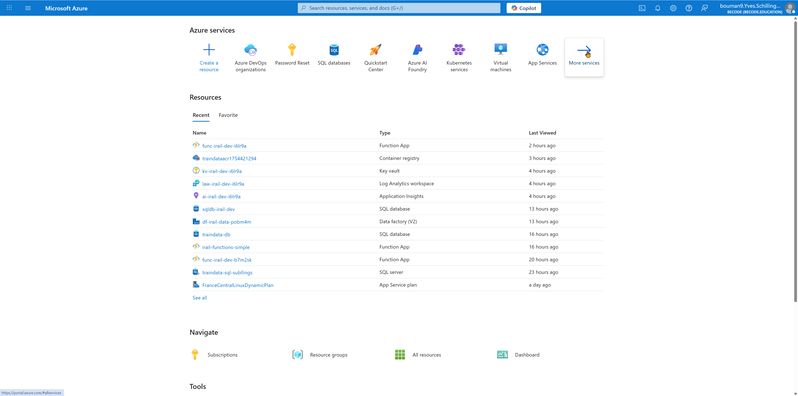
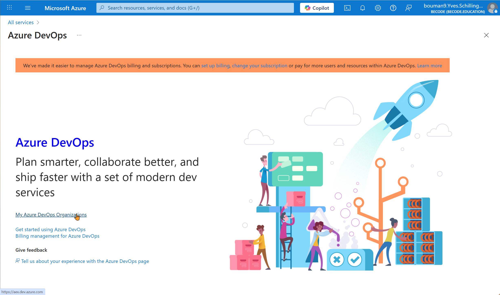
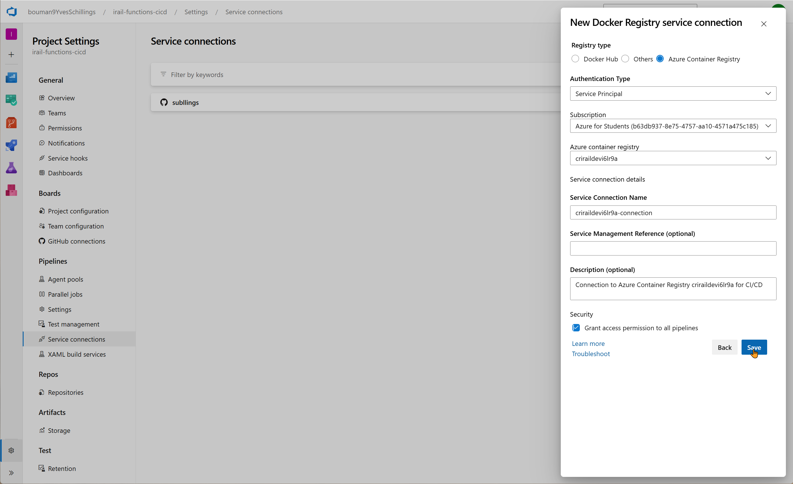

# Terraform Infrastructure & Azure DevOps CI/CD Complete Guide

This document provides a comprehensive guide for deploying Azure infrastructure using Terraform, followed by setting up Power BI dashboards, GitHub Actions, and Azure DevOps CI/CD pipelines.

## Document Structure

- **Section I: Terraform Infrastructure Setup** - Deploy the foundational Azure resources
- **Section II: Power BI Dashboard Configuration** - Set up data visualization and analytics
- **Section III: GitHub Actions CI/CD** - Alternative CI/CD solution using GitHub Actions
- **Section IV: Azure DevOps CI/CD Configuration** - Enterprise CI/CD using Azure - DevOps

## Recommended Workflow

### 1. Start with Infrastructure (Section I)
Deploy your Azure resources using Terraform to establish the foundation:
- Azure Functions App for your APIs
- SQL Database for data storage  
- Data Factory for automated data collection
- Container Registry for CI/CD deployments

### 2. Set up Analytics (Section II) 
Configure Power BI dashboards to visualize your train data:
- Connect to Azure Functions API endpoints
- Create interactive reports and dashboards
- Set up automated data refresh

### 3. Choose Your CI/CD Strategy
**Option A: GitHub Actions (Section III)**
- Best for: GitHub-native workflows, simpler setup, cost-effective
- Ideal for: Smaller teams, open source projects, GitHub-first organizations

**Option B: Azure DevOps (Section IV)**
- Best for: Enterprise scenarios, advanced pipeline features, fine-grained control
- Ideal for: Larger teams, complex deployment scenarios, enterprise requirements

### 4. Implementation Order
1. **Required**: Section I (Infrastructure) - Foundation for everything else
2. **Recommended**: Section II (Power BI) - Data visualization and analytics  
3. **Choose One**: Section III (GitHub Actions) OR Section IV (Azure DevOps) - CI/CD pipeline

---

# Section I: Terraform Infrastructure Setup

## Complete Infrastructure Overview

This section contains the complete Terraform infrastructure for the iRail Train Data project, including Azure Functions, SQL Server, Data Factory, and all supporting resources.

## High-Level Architecture

  


The architecture consists of several key components working together:

### Data Flow
1. **iRail API** → Provides real-time Belgian train data
2. **Azure Data Factory** → Scheduled data collection every 5 minutes
3. **Azure Functions** → REST API endpoints for data access and Power BI integration
4. **Azure SQL Database** → Structured data storage with tables for Stations, Vehicles, Departures, and Connections
5. **Azure Key Vault** → Secure storage of connection strings and API keys
6. **Power BI Service** → Interactive dashboards and analytics

### Security & Identity
- **Managed Identity** for secure authentication between services
- **Azure Key Vault** for centralized secret management
- **RBAC** controls for fine-grained access permissions

### Monitoring & Operations  
- **Application Insights** for telemetry and performance monitoring
- **Log Analytics** for centralized logging
- **Automated scaling** with Y1 Consumption Plan

## Current Infrastructure Status
- **Infrastructure Deployed**: Y1 Consumption Plan in France Central
- **Function App**: `func-irail-dev-i6lr9a` (Running)
- **Database**: SQL Server with automated data collection
- **Data Factory**: Automated pipelines every 5 minutes
- **Monitoring**: Application Insights + Log Analytics

## Architecture Components

### Core Infrastructure
- **Resource Group**: Container for all related resources
- **App Service Plan**: Hosting plan for Azure Functions (Y1 for staging, FC1 for production)
- **Azure Functions**: Serverless compute for iRail API endpoints
- **SQL Server + Database**: Managed database for train data storage
- **Application Insights**: Monitoring and telemetry
- **Storage Account**: Function runtime and file storage
- **Key Vault**: Secure secret management
- **Container Registry**: Docker image repository
- **Managed Identity**: Secure authentication without passwords

### Data Processing
- **Azure Data Factory**: Automated data collection and ETL pipelines
- **Data Factory Pipelines**: Scheduled data collection from iRail API
- **Data Factory Triggers**: Time-based execution (every 5 minutes)

## Infrastructure Files Structure
```
infrastructure/
├── main.tf                    # Core resource definitions and providers
├── variables.tf               # Input variables and validation
├── outputs.tf                 # Output values for CI/CD integration
├── app-service-plan.tf        # App Service Plan for Azure Functions
├── azure-functions.tf         # Azure Functions App configuration
├── sql-server.tf              # SQL Server and Database
├── data-factory.tf            # Legacy/initial Data Factory setup
├── data-factory-pipeline.tf   # Legacy/initial pipelines
├── data-factory-triggers.tf   # Legacy/initial triggers
├── data-factory-outputs.tf    # Data Factory outputs
├── data-factory2.tf           # Terraform-managed ADF v2 (current)
├── data-factory2-pipeline.tf  # ADF v2 pipelines (current)
├── data-factory2-triggers.tf  # ADF v2 triggers (current)
├── staging.tfvars             # Staging environment variables
├── dev.tfvars                 # Dev environment variables
├── production.tfvars          # Production environment variables
├── terraform.tfvars           # Shared/default variables
├── README.md                  # Infrastructure documentation
├── README-ENV.md              # Environment variables docs
├── .env.template              # Template for local env files
├── .env.staging               # Current staging env values
└── (generated) .terraform/, terraform.tfstate*, *.tfplan, tfplan, main.tf.backup
```

## Environment Strategy

### Current Deployment (Staging/Dev)
- **Purpose**: Development and testing
- **Plan Type**: Y1 (Consumption Plan) - Most cost-effective
- **Function App**: `func-irail-dev-i6lr9a`
- **Resource Group**: `rg-irail-dev-i6lr9a`
- **URL**: https://func-irail-dev-i6lr9a.azurewebsites.net
- **Region**: France Central
- **Runtime**: Python 3.12
- **Timeout**: 5 minutes (Y1 limit)
- **Subscription**: Azure for Students

### Data Factory (ADF2 - Terraform-managed)
- Using Terraform-managed factory `df-irail-data-v2-<suffix>` with a 5-minute collection trigger.
- Get the exact name from Terraform output `data_factory_info.name`.
- Direct links (replace <suffix> with your actual suffix):
  - ADF Studio: https://adf.azure.com/en/authoring/pipeline/pipeline_irail_enhanced_collection?factory=%2Fsubscriptions%2Fb63db937-8e75-4757-aa10-4571a475c185%2FresourceGroups%2Frg-irail-dev-b7m2sk%2Fproviders%2FMicrosoft.DataFactory%2Ffactories%2Fdf-irail-data-zqlb95
  

### Production Environment (Future)
- Purpose: Live production workload
- Plan Type: FC1 (Flex Consumption) recommended; Y1 optional for low-cost
- Function App: func-irail-production-{random-suffix}
- Resource Group: rg-irail-production-{random-suffix}
- URL: https://func-irail-production-{random-suffix}.azurewebsites.net
- Deployment: Manual approval required

Note: The `{random-suffix}` is automatically generated by Terraform (currently `b7m2sk`) to ensure global uniqueness across all Azure subscriptions.

## Terraform Deployment Commands

### Deploy Infrastructure (Current Setup)
```bash
# Deploy infrastructure and functions (Y1 plan)
./scripts/teraform-deploy-staging-Y1.sh

# Deploy Function App code
./scripts/deploy-irail-functions.sh

# Test endpoints
python scripts/test_all_endpoints_local.py

# Check deployment status
cd infrastructure
terraform output
```

## Terraform Infrastructure Summary

### What Gets Deployed
The Terraform configuration provisions a complete Azure infrastructure optimized for the iRail Train Data project:

#### Core Services
- **Azure Functions App** (`func-irail-dev-i6lr9a`): Serverless compute with Python 3.12 runtime
- **SQL Server & Database** (`sql-irail-dev-i6lr9a`): Managed database for train data storage
- **Azure Data Factory v2** (`df-irail-data-*`): Automated data collection every 5 minutes
- **Application Insights** (`appi-irail-dev-*`): Monitoring and performance telemetry
- **Storage Account** (`stiraildevi6lr9a`): Function runtime and file storage
- **Container Registry** (`criraildevi6lr9a`): Docker image repository for CI/CD
- **Key Vault** (`kv-irail-dev-*`): Secure secret management

#### Infrastructure Highlights
- **Cost-Optimized**: Y1 Consumption Plan for minimal costs during development
- **Auto-Scaling**: Serverless architecture that scales based on demand
- **Global Uniqueness**: Random suffixes ensure unique resource names
- **Security**: Managed identities and Key Vault for secure authentication
- **Monitoring**: Full observability with Application Insights and Log Analytics

#### Resource Naming Convention
All resources follow the pattern: `{service}-irail-{environment}-{random-suffix}`
- Example: `func-irail-dev-i6lr9a`, `sql-irail-dev-i6lr9a`
- Random suffix ensures global uniqueness across all Azure subscriptions

#### Data Collection Pipeline
- **Automated Collection**: Data Factory pipelines collect iRail data every 5 minutes
- **Storage**: Train data stored in SQL Database with optimized schema
- **API Endpoints**: RESTful APIs expose data for Power BI and analytics

### Infrastructure Benefits
- **Ready for Production**: Easy scale-up with FC1 plan or Premium functions
- **CI/CD Ready**: Container Registry supports automated deployments
- **Data-Driven**: Built-in analytics and monitoring capabilities
- **Cost-Effective**: Pay-per-use model minimizes costs during development

### Environment Configurations

#### Environment to App Service Plan Mapping

| Environment | SKU | Plan Type | Monthly Cost |
|-------------|-----|-----------|--------------|
| staging | Y1 | Consumption Plan | ~&euro;0-5 |
| production | FC1 | Flex Consumption | ~&euro;20-50 |

**Azure Function Hosting Plans Comparison:**

| Plan Type | Monthly Cost | Cold Starts | Scaling | Use Case | Availability |
|-----------|-------------|-------------|----------|----------|-------------|
| **Y1 (Consumption)** | ~&euro;0-5 | Yes (slower) | Automatic | Development/Testing |  Azure for Students |
| **FC1 (Flex Consumption)** | ~&euro;20-50 | Reduced | Faster | Production Serverless |  Not in free tier |
| **Premium (EP1+)** | ~&euro;150+ | None (Always On) | Instant | Enterprise Production |  Not in free tier |

**Plan Details:**

- **Y1 (Consumption Plan)**: 
  - Pay-per-execution with cold starts
  - Ideal for development/staging with low traffic
  - **Available in Azure for Students** - Perfect for learning and development
  - Sufficient for educational and development purposes

- **FC1 (Flex Consumption)**: 
  - Faster scaling and reduced cold starts compared to Y1
  - Better performance for production serverless workloads
  - **Not available in Azure for Students** free tier
  - Recommended for production when cold start performance matters

- **Premium Plans (EP1, EP2, EP3)**:
  - Always On capability (no cold starts)
  - VNET integration for enterprise security
  - Higher throughput and longer execution timeouts (up to 60 minutes)
  - **Not available in Azure for Students** and significantly more expensive
  - Reserved for enterprise production environments with strict performance requirements

**For Development Environment (Current Setup):**
The Y1 Consumption Plan is perfectly adequate for:
- Learning and development purposes
- Function testing and validation
- Educational project presentations
- Low-traffic educational projects
- Cost-effective exploration of Azure Functions

**Note**: Our current setup uses Y1 because it's included in the Azure for Students subscription and provides all necessary functionality for development and learning purposes without additional costs.

#### Staging Environment
**Purpose**: Testing and validation before production deployment

**Resources:**
- App Service Plan: Y1 (Consumption Plan) - Pay per execution, most cost-effective for low traffic, included in Azure for Students
- SQL Database: Basic SKU (5 DTU) - Minimal performance for testing
- Backup Retention: 7 days
- Storage: LRS (Locally Redundant Storage)

**Cost**: ~&euro;0-10/month (mostly covered by Azure for Students free credits)

#### Production Environment
**Purpose**: Live production workload with consistent performance

**Resources:**
- App Service Plan: FC1 (Flex Consumption) - Better performance and scaling than Y1, **not available in Azure for Students**
- SQL Database: S2 Standard (50 DTU) - Production workload capacity
- Backup Retention: 35 days with long-term retention
- Storage: GRS (Geo-Redundant Storage)

**Cost**: ~&euro;20-60/month (requires paid subscription)

## Available Deployment Scripts

The project includes automated deployment scripts located in the `scripts/` folder:

- **`scripts/terraform-deploy-staging-Y1.sh`** - Deploy staging environment with Y1 plan (current deployment)
- **`scripts/terraform-deploy-staging-FC1.sh`** - Deploy staging environment with FC1 plan (better performance)
- **`scripts/terraform-deploy-production.sh`** - Deploy production environment only (FC1 plan, production-grade resources)
- **`scripts/terraform-deploy-complete-infrastructure.sh`** - Deploy complete infrastructure including Data Factory
- **`scripts/terraform-deploy-data-factory.sh`** - Deploy only Data Factory components

All scripts include:
- Azure authentication validation
- Terraform initialization and planning
- Interactive confirmation prompts
- Deployment validation and output display
- English-only interface (no emojis)

## Manual Infrastructure Deployment

### Deploy ONLY Staging (Recommended)

**Option 1: Automated script (Simpler)**
```bash
# Execute from project root - Y1 plan (current setup)
./scripts/terraform-deploy-staging-Y1.sh

# Or FC1 plan (better performance)
./scripts/terraform-deploy-staging-FC1.sh
```

**Option 2: Manual commands**
```bash
# 1. Navigate to infrastructure directory
cd infrastructure

# 2. Load staging environment variables
source .env.staging

# 3. Initialize Terraform (first time only)
terraform init

# 4. Plan staging deployment
terraform plan -var-file="staging.tfvars"

# 5. Deploy staging
terraform apply -var-file="staging.tfvars"
```

### Complete Deployment (Staging + Production)

**Option 1: Automated scripts (Recommended)**
```bash
# Deploy staging first (Y1 plan)
./scripts/terraform-deploy-staging-Y1.sh

# Deploy production (after staging validation)
./scripts/terraform-deploy-production.sh
```

**Option 2: Manual Terraform commands**

**Initialize Terraform**
```bash
cd infrastructure
terraform init
```

**Plan Deployment (Staging)**
```bash
# Load staging environment variables
source .env.staging

# Plan deployment with staging configuration
terraform plan -var-file="staging.tfvars"
```

**Apply Deployment (Staging)**
```bash
# Load staging environment variables (if not already done)
source .env.staging

# Apply deployment with staging configuration
terraform apply -var-file="staging.tfvars"
```

**Plan Deployment (Production)**
```bash
# Load production environment variables
source .env.production

# Plan deployment with production configuration
terraform plan -var-file="production.tfvars"
```

**Apply Deployment (Production)**
```bash
# Load production environment variables (if not already done)
source .env.production

# Apply deployment with production configuration
terraform apply -var-file="production.tfvars"
```

## Terraform Infrastructure Configuration

### Main Terraform Configuration (main.tf)
```hcl
terraform {
  required_version = ">= 1.0"
  required_providers {
    azurerm = {
      source  = "hashicorp/azurerm"
      version = "~> 3.80"
    }
    random = {
      source  = "hashicorp/random"
      version = "~> 3.4"
    }
  }
  backend "azurerm" {
    resource_group_name  = "rg-terraform-state"
    storage_account_name = "terraformstate${random_id.suffix.hex}"
    container_name       = "tfstate"
    key                  = "irail.tfstate"
  }
}

provider "azurerm" {
  features {
    resource_group {
      prevent_deletion_if_contains_resources = false
    }
  }
}

# Random suffix for unique naming
resource "random_id" "suffix" {
  byte_length = 4
}

# Data sources
data "azurerm_client_config" "current" {}

# Resource Group
resource "azurerm_resource_group" "main" {
  name     = "rg-${var.project_name}-${var.environment}-${random_id.suffix.hex}"
  location = var.location

  tags = {
    environment = var.environment
    project     = var.project_name
    managed_by  = "terraform"
  }
}

# Storage Account for Function App
resource "azurerm_storage_account" "function_storage" {
  name                     = "st${var.project_name}${var.environment}${random_id.suffix.hex}"
  resource_group_name      = azurerm_resource_group.main.name
  location                = azurerm_resource_group.main.location
  account_tier             = "Standard"
  account_replication_type = "LRS"

  tags = azurerm_resource_group.main.tags
}

# Application Insights
resource "azurerm_application_insights" "main" {
  name                = "appi-${var.project_name}-${var.environment}-${random_id.suffix.hex}"
  location            = azurerm_resource_group.main.location
  resource_group_name = azurerm_resource_group.main.name
  application_type    = "web"

  tags = azurerm_resource_group.main.tags
}

# Key Vault for secure secret management
resource "azurerm_key_vault" "main" {
  name                = "kv-${var.project_name}-${var.environment}-${random_id.suffix.hex}"
  location            = azurerm_resource_group.main.location
  resource_group_name = azurerm_resource_group.main.name
  tenant_id           = data.azurerm_client_config.current.tenant_id

  sku_name = "standard"

  # Enable for deployment
  enabled_for_deployment          = true
  enabled_for_disk_encryption     = true
  enabled_for_template_deployment = true

  # Soft delete and purge protection
  soft_delete_retention_days = 7
  purge_protection_enabled   = false

  tags = azurerm_resource_group.main.tags
}

# Key Vault Access Policy for current user/service principal
resource "azurerm_key_vault_access_policy" "current" {
  key_vault_id = azurerm_key_vault.main.id
  tenant_id    = data.azurerm_client_config.current.tenant_id
  object_id    = data.azurerm_client_config.current.object_id

  secret_permissions = [
    "Get", "List", "Set", "Delete", "Purge"
  ]

  certificate_permissions = [
    "Get", "List", "Create", "Import", "Delete", "Purge"
  ]

  key_permissions = [
    "Get", "List", "Create", "Delete", "Purge"
  ]
}

# User Assigned Managed Identity for Function App
resource "azurerm_user_assigned_identity" "function_identity" {
  name                = "id-${var.project_name}-${var.environment}-${random_id.suffix.hex}"
  location            = azurerm_resource_group.main.location
  resource_group_name = azurerm_resource_group.main.name

  tags = azurerm_resource_group.main.tags
}

# App Service Plan
resource "azurerm_service_plan" "main" {
  name                = "asp-${var.project_name}-${var.environment}-${random_id.suffix.hex}"
  resource_group_name = azurerm_resource_group.main.name
  location            = azurerm_resource_group.main.location
  os_type             = "Linux"
  sku_name            = var.environment == "production" ? "FC1" : "Y1"

  tags = azurerm_resource_group.main.tags
}

# SQL Server
resource "azurerm_mssql_server" "main" {
  name                         = "sql-${var.project_name}-${var.environment}-${random_id.suffix.hex}"
  resource_group_name          = azurerm_resource_group.main.name
  location                     = azurerm_resource_group.main.location
  version                      = "12.0"
  administrator_login          = var.sql_admin_username
  administrator_login_password = var.sql_admin_password

  tags = azurerm_resource_group.main.tags
}

# SQL Database
resource "azurerm_mssql_database" "main" {
  name           = "sqldb-${var.project_name}-${var.environment}"
  server_id      = azurerm_mssql_server.main.id
  collation      = "SQL_Latin1_General_CP1_CI_AS"
  license_type   = "LicenseIncluded"
  max_size_gb    = var.environment == "production" ? 100 : 20
  sku_name       = var.environment == "production" ? "S2" : "S0"

  tags = azurerm_resource_group.main.tags
}

# SQL Firewall Rule for Azure Services
resource "azurerm_mssql_firewall_rule" "azure_services" {
  name             = "AllowAzureServices"
  server_id        = azurerm_mssql_server.main.id
  start_ip_address = "0.0.0.0"
  end_ip_address   = "0.0.0.0"
}

# Container Registry (shared across environments)
data "azurerm_container_registry" "main" {
  name                = "traindataacr1754421294"
  resource_group_name = "traindata-app-rg" // corrected RG
}

# Store SQL connection string in Key Vault
resource "azurerm_key_vault_secret" "sql_connection_string" {
  name         = "sql-connection-string"
  value        = "Server=tcp:${azurerm_mssql_server.main.fully_qualified_domain_name},1433;Initial Catalog=${azurerm_mssql_database.main.name};Authentication=Active Directory Managed Identity;User Id=${azurerm_user_assigned_identity.function_identity.client_id};Encrypt=True;TrustServerCertificate=False;Connection Timeout=30;"
  key_vault_id = azurerm_key_vault.main.id

  depends_on = [azurerm_key_vault_access_policy.current]
}

# Azure Function App
resource "azurerm_linux_function_app" "main" {
  name                = "func-${var.project_name}-${var.environment}-${random_id.suffix.hex}"
  resource_group_name = azurerm_resource_group.main.name
  location            = azurerm_resource_group.main.location

  storage_account_name       = azurerm_storage_account.function_storage.name
  storage_account_access_key = azurerm_storage_account.function_storage.primary_access_key
  service_plan_id            = azurerm_service_plan.main.id

  site_config {
    always_on = var.environment == "production" ? true : false

    application_stack {
      docker {
        registry_url = "https://${data.azurerm_container_registry.main.login_server}"
        image_name   = "traindata-function"
        image_tag    = "latest"
      }
    }

    cors {
      allowed_origins     = ["*"]
      support_credentials = false
    }
  }

  app_settings = {
    "WEBSITES_ENABLE_APP_SERVICE_STORAGE" = "false"
    "DOCKER_REGISTRY_SERVER_URL"          = "https://${data.azurerm_container_registry.main.login_server}"
    "DOCKER_REGISTRY_SERVER_USERNAME"     = data.azurerm_container_registry.main.admin_username
    "DOCKER_REGISTRY_SERVER_PASSWORD"     = data.azurerm_container_registry.main.admin_password
    "FUNCTIONS_WORKER_RUNTIME"            = "python"
    "FUNCTIONS_EXTENSION_VERSION"         = "~4"
    "APPLICATIONINSIGHTS_CONNECTION_STRING" = azurerm_application_insights.main.connection_string
    "SQL_CONNECTION_STRING" = "@Microsoft.KeyVault(VaultName=${azurerm_key_vault.main.name};SecretName=sql-connection-string)"
    "ENVIRONMENT"                         = var.environment
  }

  identity {
    type         = "UserAssigned"
    identity_ids = [azurerm_user_assigned_identity.function_identity.id]
  }

  tags = azurerm_resource_group.main.tags

  depends_on = [
    azurerm_key_vault_access_policy.function_app,
    azurerm_key_vault_secret.sql_connection_string
  ]
}

# Key Vault Access Policy for Function App Managed Identity
resource "azurerm_key_vault_access_policy" "function_app" {
  key_vault_id = azurerm_key_vault.main.id
  tenant_id    = data.azurerm_client_config.current.tenant_id
  object_id    = azurerm_user_assigned_identity.function_identity.principal_id

  secret_permissions = [
    "Get", "List"
  ]
}
```

### Variables Configuration (variables.tf)
```hcl
variable "project_name" {
  description = "Name of the project"
  type        = string
  default     = "irail"
}

variable "environment" {
  description = "Environment name (staging, production)"
  type        = string
  validation {
    condition     = contains(["staging", "production"], var.environment)
    error_message = "Environment must be either 'staging' or 'production'."
  }
}

variable "location" {
  description = "Azure region for resources"
  type        = string
  default     = "West Europe"
}

variable "sql_admin_username" {
  description = "SQL Server administrator username"
  type        = string
  sensitive   = true
}

variable "sql_admin_password" {
  description = "SQL Server administrator password"
  type        = string
  sensitive   = true
  validation {
    condition     = length(var.sql_admin_password) >= 12
    error_message = "SQL admin password must be at least 12 characters long."
  }
}

variable "subscription_id" {
  description = "Azure subscription ID"
  type        = string
}
```

### Outputs Configuration (outputs.tf)
```hcl
output "resource_group_name" {
  description = "Name of the created resource group"
  value       = azurerm_resource_group.main.name
}

output "function_app_name" {
  description = "Name of the created Function App"
  value       = azurerm_linux_function_app.main.name
}

output "function_app_url" {
  description = "URL of the Function App"
  value       = "https://${azurerm_linux_function_app.main.default_hostname}"
}

output "sql_server_fqdn" {
  description = "Fully qualified domain name of the SQL Server"
  value       = azurerm_mssql_server.main.fully_qualified_domain_name
  sensitive   = true
}

output "sql_database_name" {
  description = "Name of the SQL Database"
  value       = azurerm_mssql_database.main.name
}

output "application_insights_connection_string" {
  description = "Application Insights connection string"
  value       = azurerm_application_insights.main.connection_string
  sensitive   = true
}

output "storage_account_name" {
  description = "Name of the storage account"
  value       = azurerm_storage_account.function_storage.name
}

output "app_service_plan_name" {
  description = "Name of the App Service Plan"
  value       = azurerm_service_plan.main.name
}

output "key_vault_name" {
  description = "Name of the Key Vault"
  value       = azurerm_key_vault.main.name
}

output "key_vault_uri" {
  description = "URI of the Key Vault"
  value       = azurerm_key_vault.main.vault_uri
}

output "function_identity_client_id" {
  description = "Client ID of the Function App User Assigned Managed Identity"
  value       = azurerm_user_assigned_identity.function_identity.client_id
}
```

### Environment-Specific Variables

**staging.tfvars**
```hcl
environment = "staging"
location    = "West Europe"
project_name = "irail"
```

**production.tfvars**
```hcl
environment = "production"
location    = "West Europe"
project_name = "irail"
```

## Terraform State Management

### Backend Configuration
The Terraform state is stored in Azure Storage for:
- **State Locking**: Prevents concurrent modifications
- **Team Collaboration**: Shared state across team members
- **Backup and Recovery**: Automatic state backup
- **Encryption**: State file encryption at rest

### State Storage Setup
```bash
# Create storage account for Terraform state
az group create --name rg-terraform-state --location westeurope

az storage account create \
  --name terraformstate$(openssl rand -hex 4) \
  --resource-group rg-terraform-state \
  --location westeurope \
  --sku Standard_LRS \
  --encryption-services blob

az storage container create \
  --name tfstate \
  --account-name terraformstate$(openssl rand -hex 4)
```

**Next Steps**: 
- **Section II**: Configure Power BI dashboards for data visualization
- **Section III**: Set up GitHub Actions for CI/CD (alternative approach)
- **Section IV**: Set up Azure DevOps for enterprise CI/CD pipelines


### About the Y1 (Consumption) Plan

The Y1 plan is the Azure Functions Consumption plan SKU. It provides a serverless, cost-efficient execution model suitable for development, testing, and low-to-moderate traffic workloads.

Key characteristics:
- **Pay-per-execution**: Only charged when functions run
- **Automatic scaling**: Scales from 0 to 200 instances
- **5-minute timeout**: Maximum execution time limit
- **Memory**: 1.5GB per instance
- **Cost**: Very low for development/testing scenarios
- **Cold starts**: May experience delays on first invocation after idle period

## Post-Deployment Verification

### Quick Status Check Commands

After deployment, use these commands to verify your infrastructure:

```bash
# Check Function App status
az functionapp show --name func-irail-dev-i6lr9a --resource-group rg-irail-dev-i6lr9a --query "state"

# Test Function endpoints
curl https://func-irail-dev-i6lr9a.azurewebsites.net/api/health
curl https://func-irail-dev-i6lr9a.azurewebsites.net/api/stations
curl "https://func-irail-dev-i6lr9a.azurewebsites.net/api/powerbi?data_type=stations"
```

Note: The Power BI endpoint requires the data_type query parameter. Valid values are: departures, stations, delays, peak_hours, vehicles, connections. Examples:

```bash
curl "https://func-irail-dev-i6lr9a.azurewebsites.net/api/powerbi?data_type=departures"
curl "https://func-irail-dev-i6lr9a.azurewebsites.net/api/powerbi?data_type=delays"
curl "https://func-irail-dev-i6lr9a.azurewebsites.net/api/powerbi?data_type=peak_hours"
```

### Deployment Status - Current Environment

**Successfully Deployed (Y1 Plan - France Central)**
- **Function App**: `func-irail-dev-i6lr9a` - Running
- **Resource Group**: `rg-irail-dev-i6lr9a` - Active  
- **SQL Database**: `sqldb-irail-dev` - Online
- **Data Factory v2**: `df-irail-data-zqlb95` - Pipelines Scheduled
- **Application Insights**: Monitoring Active
- **Location**: France Central
- **Plan**: Y1 Consumption (Cost-Optimized)

### Expected Deployment Outcome

When your staging deployment is successful, you should see the following:

#### Function App Status Page
When visiting your Function App URL: `https://func-irail-dev-i6lr9a.azurewebsites.net`

**Expected Outcome:**
- Azure Functions welcome page displaying **"Your Functions 4.0 app is up and running"**
- Blue Azure background with Function App icon
- Confirmation that the Function App is properly deployed and accessible
- This page indicates that:
  - The Function App service is online
  - The runtime (Python 3.12) is properly configured
  - The Y1 Consumption Plan is active
  - The application is ready to receive API requests

  

#### Verification Steps
1. **Visit the Function App URL** - Should display the Azure Functions welcome page
2. **Test API Endpoints** - All endpoints should return valid responses
3. **Check Azure Portal** - Function App status should show as "Running"
4. **Monitor Application Insights** - Telemetry should be flowing

This welcome page confirms your deployment was successful and the Function App is ready for use.

### Testing and Validation

1. **Function App Endpoints**:
   - Health Check: `https://func-irail-dev-i6lr9a.azurewebsites.net/api/health`
   - Stations API: `https://func-irail-dev-i6lr9a.azurewebsites.net/api/stations`
   - Liveboard API: `https://func-irail-dev-i6lr9a.azurewebsites.net/api/liveboard`
   - Analytics API: `https://func-irail-dev-i6lr9a.azurewebsites.net/api/analytics`
   - PowerBI Data: `https://func-irail-dev-i6lr9a.azurewebsites.net/api/powerbi`

2. **Database Verification**:
   ```bash
   # Connect to SQL Database (use Azure portal Query Editor)
   SELECT COUNT(*) FROM stations;
   SELECT COUNT(*) FROM connections;
   ```

3. **Data Factory Monitoring**:
   - Portal: Azure Portal → Data Factory → Monitor
   - Check pipeline runs every 5 minutes
   - Verify data collection from iRail API

# Section II: Power BI Dashboard Configuration

**Prerequisites**: Complete Section I (Terraform Infrastructure Setup) to have the Azure Functions API endpoints available.

## Power BI Implementation Overview

Power BI provides comprehensive analytics and visualization for the iRail Train Data project. The dashboard connects directly to your deployed Azure Functions API endpoints to display real-time and historical train data analytics.

### Architecture
```
Azure Functions API → Power BI Web Connector → Dashboard Visualizations
        ↓                        ↓                      ↓
   REST Endpoints        Data Refresh         Interactive Reports
```

## PowerBI File Location
The PowerBI `.pbix` file is located in the `./powerbi/` directory of your project.

## Required Data Connections

The Power BI dashboard connects to the Azure Function's PowerBI API endpoint with different data types for comprehensive train data analytics:

### Connection 1: Departures Data
```
URL: https://func-irail-dev-i6lr9a.azurewebsites.net/api/powerbi?data_type=departures
```
[Test Departures Endpoint](https://func-irail-dev-i6lr9a.azurewebsites.net/api/powerbi?data_type=departures)

### Connection 2: Stations Data  
```
URL: https://func-irail-dev-i6lr9a.azurewebsites.net/api/powerbi?data_type=stations
```
[Test Stations Endpoint](https://func-irail-dev-i6lr9a.azurewebsites.net/api/powerbi?data_type=stations)

### Connection 3: Delays Data
```
URL: https://func-irail-dev-i6lr9a.azurewebsites.net/api/powerbi?data_type=delays
```
[Test Delays Endpoint](https://func-irail-dev-i6lr9a.azurewebsites.net/api/powerbi?data_type=delays)

### Connection 4: Peak Hours Data
```
URL: https://func-irail-dev-i6lr9a.azurewebsites.net/api/powerbi?data_type=peak_hours
```
[Test Peak Hours Endpoint](https://func-irail-dev-i6lr9a.azurewebsites.net/api/powerbi?data_type=peak_hours)

### Connection 5: Vehicles Data
```
URL: https://func-irail-dev-i6lr9a.azurewebsites.net/api/powerbi?data_type=vehicles
```
[Test Vehicles Endpoint](https://func-irail-dev-i6lr9a.azurewebsites.net/api/powerbi?data_type=vehicles)

### Connection 6: Connections Data
```
URL: https://func-irail-dev-i6lr9a.azurewebsites.net/api/powerbi?data_type=connections
```
[Test Connections Endpoint](https://func-irail-dev-i6lr9a.azurewebsites.net/api/powerbi?data_type=connections)

## Data Endpoints for Analytics

These specialized endpoints provide structured data optimized for Power BI analytics and visualization:

- **Departures**: Real-time and historical departure information from Belgian railway stations
- **Stations**: Station metadata, usage statistics, and geographical data  
- **Delays**: Delay patterns, statistics, and trends across the railway network
- **Peak Hours**: Traffic patterns by time of day, day of week, and station location
- **Vehicles**: Rolling stock information, utilization rates, and fleet analytics
- **Connections**: Route connectivity, transfer data, and journey planning insights

## Setting Up Power BI Connections

### Step-by-Step Setup

1. **Open Power BI Desktop**
2. **Get Data** → **Web** → **Advanced**  
3. **Enter the URL** for each data type endpoint above
4. **Configure authentication** (if required by your Function App)
5. **Set up data refresh** for real-time dashboard updates
6. **Create relationships** between tables using common fields (station_id, vehicle_id, etc.)
7. **Build visualizations** using the imported datasets

### Authentication Configuration
- **Anonymous**: Default for publicly accessible endpoints
- **API Key**: If you've enabled function-level authentication
- **OAuth2**: For enterprise scenarios with Azure AD integration

## Dashboard Features

The Power BI implementation provides:
- **Real-time Monitoring**: Live departure and delay tracking
- **Historical Analysis**: Trends in delays, peak usage, and performance metrics
- **Geographic Visualization**: Station locations and route mapping
- **Performance KPIs**: On-time performance, average delays, and capacity utilization
- **Predictive Analytics**: Peak hour forecasting and delay prediction models

## Data Refresh Configuration

### Scheduled Refresh
- **Frequency**: Recommended every 15-30 minutes for near real-time data
- **Data Source**: Azure Functions API endpoints automatically updated by Data Factory
- **Incremental Refresh**: Configure for large datasets to improve performance

### Real-time Dashboard
For truly real-time updates, consider:
- **Power BI Streaming Datasets**: Direct integration with Azure Stream Analytics
- **Power BI REST API**: Programmatic updates from Azure Functions
- **Power BI Embedded**: Custom applications with real-time capabilities

---

# Section III: GitHub Actions CI/CD

**Prerequisites**: Complete Section I (Terraform Infrastructure Setup) to have target Azure resources available.

## GitHub Actions Overview

GitHub Actions provides a native CI/CD solution integrated directly with your GitHub repository. This section covers setting up automated deployment pipelines using GitHub Actions as an alternative to Azure DevOps.

### Why Choose GitHub Actions?

#### Advantages
- **Native Integration**: Built into GitHub, no external service needed
- **Repository Secrets**: Secure secret management per repository
- **OIDC Authentication**: Passwordless authentication with Azure
- **Actions Marketplace**: Large ecosystem of pre-built actions
- **Cost-Effective**: Free for public repositories, generous limits for private repos
- **Workflow as Code**: YAML-based configuration stored in your repository

#### Comparison with Azure DevOps
- **GitHub Actions**: Best for GitHub-native workflows, simpler setup, great for open source
- **Azure DevOps**: Enterprise features, advanced pipeline management, better for complex scenarios

## GitHub Actions Setup Guide

### Prerequisites
- GitHub repository with your project code
- Azure subscription with deployed infrastructure (from Section I)
- GitHub repository secrets configured

### 1. Configure GitHub Secrets

Navigate to your GitHub repository → Settings → Secrets and variables → Actions, and add:

```
AZURE_CLIENT_ID: [Your Azure Service Principal Client ID]
AZURE_CLIENT_SECRET: [Your Azure Service Principal Client Secret] 
AZURE_TENANT_ID: [Your Azure Tenant ID]
AZURE_SUBSCRIPTION_ID: [Your Azure Subscription ID]
REGISTRY_LOGIN_SERVER: criraildevi6lr9a.azurecr.io
REGISTRY_USERNAME: [ACR Admin Username]
REGISTRY_PASSWORD: [ACR Admin Password]
FUNCTION_APP_NAME: func-irail-dev-i6lr9a
RESOURCE_GROUP_NAME: rg-irail-dev-i6lr9a
```

### 2. Create GitHub Actions Workflow

Create `.github/workflows/azure-functions-deploy.yml`:

```yaml
name: Deploy Azure Functions

on:
  push:
    branches: [ main ]
  pull_request:
    branches: [ main ]

env:
  AZURE_FUNCTIONAPP_PACKAGE_PATH: './azure_function'
  DOCKER_IMAGE_NAME: 'traindata-function'

jobs:
  build-and-deploy:
    runs-on: ubuntu-latest
    
    steps:
    - name: 'Checkout GitHub Action'
      uses: actions/checkout@v4
    
    - name: 'Login to Azure'
      uses: azure/login@v1
      with:
        creds: |
          {
            "clientId": "${{ secrets.AZURE_CLIENT_ID }}",
            "clientSecret": "${{ secrets.AZURE_CLIENT_SECRET }}",
            "subscriptionId": "${{ secrets.AZURE_SUBSCRIPTION_ID }}",
            "tenantId": "${{ secrets.AZURE_TENANT_ID }}"
          }
    
    - name: 'Login to Container Registry'
      uses: docker/login-action@v3
      with:
        registry: ${{ secrets.REGISTRY_LOGIN_SERVER }}
        username: ${{ secrets.REGISTRY_USERNAME }}
        password: ${{ secrets.REGISTRY_PASSWORD }}
    
    - name: 'Build and Push Docker Image'
      uses: docker/build-push-action@v5
      with:
        context: ${{ env.AZURE_FUNCTIONAPP_PACKAGE_PATH }}
        push: true
        tags: |
          ${{ secrets.REGISTRY_LOGIN_SERVER }}/${{ env.DOCKER_IMAGE_NAME }}:latest
          ${{ secrets.REGISTRY_LOGIN_SERVER }}/${{ env.DOCKER_IMAGE_NAME }}:${{ github.sha }}
    
    - name: 'Deploy to Azure Functions'
      uses: Azure/functions-action@v1
      with:
        app-name: ${{ secrets.FUNCTION_APP_NAME }}
        package: ${{ env.AZURE_FUNCTIONAPP_PACKAGE_PATH }}
        publish-profile: ${{ secrets.AZURE_FUNCTIONAPP_PUBLISH_PROFILE }}
        respect-pom-xml: false
```

### 3. Alternative: OIDC Authentication (Recommended)

For enhanced security, use OIDC instead of client secrets:

```yaml
permissions:
  id-token: write
  contents: read

jobs:
  build-and-deploy:
    runs-on: ubuntu-latest
    
    steps:
    - name: 'Checkout GitHub Action'
      uses: actions/checkout@v4
      
    - name: 'Azure Login with OIDC'
      uses: azure/login@v1
      with:
        client-id: ${{ secrets.AZURE_CLIENT_ID }}
        tenant-id: ${{ secrets.AZURE_TENANT_ID }}
        subscription-id: ${{ secrets.AZURE_SUBSCRIPTION_ID }}
```

### 4. Workflow Triggers

Configure different triggers for different scenarios:

```yaml
on:
  push:
    branches: [ main, develop ]
    paths:
      - 'azure_function/**'
      - '.github/workflows/**'
  
  pull_request:
    branches: [ main ]
    
  schedule:
    - cron: '0 2 * * 0'  # Weekly deployment on Sunday 2 AM UTC
  
  workflow_dispatch:  # Manual trigger
    inputs:
      environment:
        description: 'Environment to deploy to'
        required: true
        default: 'staging'
        type: choice
        options:
          - staging
          - production
```

## GitHub Actions Best Practices

### Environment Management
- Use GitHub Environments for staging/production separation
- Configure environment protection rules
- Set up environment-specific secrets

### Security
- Use OIDC authentication when possible
- Limit secret scope to specific repositories
- Regularly rotate secrets and access tokens
- Use least-privilege service principals

### Performance
- Cache Docker layers for faster builds
- Use matrix builds for multiple environments
- Parallelize independent jobs

### Monitoring
- Set up notification actions for failures
- Use GitHub Status Checks for PR validation
- Monitor workflow execution times and costs

---

# Section IV: Azure DevOps CI/CD Configuration

### About the Y1 (Consumption) plan

The Y1 plan is the Azure Functions Consumption plan SKU. It provides a serverless, cost-efficient execution model suitable for development, testing, and low-to-moderate traffic workloads.

Key characteristics:
- Billing: Pay per execution, execution time, and memory (GB-s). No fixed monthly instance cost.
- Scaling: Automatic, event-driven horizontal scale. Instances are added/removed based on load.
- Cold starts: Functions may experience cold starts after periods of inactivity.
- Time limits: Default function timeout is 5 minutes for HTTP requests (configurable up to 10 minutes via host.json). For longer-running tasks, use Flex Consumption (FC1) or Premium.
- Platform: Linux Consumption with ephemeral file system; features like WEBSITE_TIME_ZONE/TZ are not supported.
- Always On: Not available on Consumption; use FC1 or Premium for Always On behavior.

When to use Y1:
- Development and staging environments.
- Cost-sensitive scenarios with bursty or infrequent traffic.
- Workloads that can tolerate cold starts and short execution windows.

Alternatives:
- FC1 (Flex Consumption): Faster scaling, reduced cold starts, better for production serverless.
- Premium (EP1+): Always On, VNET integration at scale, higher throughput, longer timeouts.

### Current Endpoints
- Base URL: https://func-irail-dev-i6lr9a.azurewebsites.net
- Health: `/api/health`
- Stations: `/api/stations`
- Liveboard: `/api/liveboard`
- Analytics: `/api/analytics`
- PowerBI Data: `/api/powerbi`
- Collect Data: `/api/collect-data`

Note: Power BI should target `/api/powerbi` (canonical). The legacy `/api/powerbi-data` remains available for backward compatibility.

## Complete Setup Instructions

### Prerequisites
- Azure DevOps organization with project creation permissions
- Azure subscription with Contributor role (Azure for Students works)
- GitHub repository access (if using GitHub integration)
- Azure CLI installed for local testing
- PowerShell 7 (recommended) or Bash


### 2. Environment Configuration

#### Current Staging Environment (Already Deployed)
The staging environment is pre-configured and deployed:

```bash
# Current settings in infrastructure/.env.staging
export TF_VAR_sql_admin_username=sqladmin
export TF_VAR_sql_admin_password="SecurePass123!"
export TF_VAR_environment=staging
export TF_VAR_location="francecentral"
export TF_VAR_sql_sku=Basic
export TF_VAR_app_service_plan_sku=Y1
```

#### Deploy New Environment
```bash
# Use the Y1 deployment script (current setup)
./scripts/teraform-deploy-staging-Y1.sh

# Or use the FC1 deployment script (better performance)
./scripts/teraform-deploy-staging-FC1.sh
```

**For Local Development (Production):**
```bash
# Navigate to infrastructure directory
cd infrastructure

# Load production environment variables
source .env.production

# Deploy production environment
terraform init
terraform plan -var-file="production.tfvars"
terraform apply -var-file="production.tfvars"
```

**Using the Deployment Scripts:**
The automated deployment scripts already use these .env files:
### 3. Current Architecture (Successfully Deployed)

```
Azure Resources (Y1 Plan - France Central)
├── Resource Group: rg-irail-dev-i6lr9a
├── Function App: func-irail-dev-i6lr9a (Y1 Consumption Plan)
├── SQL Server: sql-irail-dev-i6lr9a + sqldb-irail-dev
├── Data Factory v2: df-irail-data-v2-<suffix> (Terraform-managed, auto data collection)
├── Storage Account: stiraildevi6lr9a
├── Key Vault: kv-irail-dev-i6lr9a  
├── Application Insights: ai-irail-dev-i6lr9a
└── Log Analytics: law-irail-dev-i6lr9a
```

**Key Features:**
- Cost-Effective: Y1 plan (~&euro;0 with Azure for Students)
- Automated Data Collection: Every 5 minutes via Data Factory
- Monitoring: Full Application Insights integration
- Security: Managed identities + Key Vault
- Database: SQL Server with automated schema

### 4. Service Connections Configuration

When setting up Azure DevOps pipelines, create these service connections:

#### 4.1 Azure Resource Manager Service Connection
1. Go to **Project Settings > Service connections**
2. Click **New service connection > Azure Resource Manager**
3. **Connection name**: `azure-service-connection`
4. **Subscription**: `Azure for Students` (ID: b63db937-8e75-4757-aa10-4571a475c185)
5. **Resource Group**: `rg-irail-dev-b7m2sk` (or leave empty)

#### 4.2 Container Registry Service Connection  
1. **New service connection > Docker Registry**
2. **Connection name**: `azure-container-registry`  
3. **Registry**: `criraildevi6lr9a.azurecr.io`

### ACR authentication options (testing choice)
- We will start with ACR Admin user for quick testing. For production, use an Azure AD Service Principal with AcrPush/AcrPull.

| Feature / Method | "OK to scope at subscription" | ACR Admin user | ACR Service Principal |
|---|---|---|---|
| What it's about | Scope of RBAC role assignment | Built-in static username/password for ACR | Azure AD identity with RBAC role for ACR |
| Level | Subscription-wide | ACR resource only | Flexible (ACR, RG, or subscription) |
| Security | Depends on role; can be risky if too broad | Weak — shared credentials, no per-user tracking | Strong — per-identity, auditable |
| Use case | When user/system needs access to many resources in subscription | Quick testing, legacy scripts | Production pipelines, secure automation |
| Revocation | Remove role at subscription | Disable admin user | Delete/disable SP or remove role |

Tip
- To fetch ACR admin credentials (if needed): Azure Portal → ACR → Access keys → Admin user.
- Or via CLI: az acr credential show --name traindataacr1754421294

### 5. Variable Groups Configuration

Create these variable groups in Azure DevOps:

#### Group 1: `irail-secrets` (Mark as secret)
```
SQL_CONNECTION_STRING: [From terraform output] (Secret)
APPLICATIONINSIGHTS_CONNECTION_STRING: [From terraform output] (Secret)
AZURE_WEB_JOBS_STORAGE: [Storage connection string] (Secret)
CONTAINER_REGISTRY_PASSWORD: [ACR password] (Secret)
```

#### Group 2: `irail-config-current`
```
FUNCTION_APP_NAME: func-irail-dev-i6lr9a
RESOURCE_GROUP_NAME: rg-irail-dev-i6lr9a
AZURE_LOCATION: francecentral
CONTAINER_REGISTRY_NAME: criraildevi6lr9a
ENVIRONMENT_NAME: dev
APP_SERVICE_PLAN_SKU: Y1
```
```
AZURE_FUNCTION_APP_NAME: func-irail-production-{random-suffix}
AZURE_RESOURCE_GROUP: rg-irail-production-{user-id}-{random-suffix}
AZURE_DATA_FACTORY_NAME: df-irail-data-production-{random-suffix}
AZURE_LOCATION: West Europe
CONTAINER_REGISTRY_URL: traindataacr1754421294.azurecr.io
ENVIRONMENT_NAME: production
AZURE_APP_INSIGHTS_NAME: [App Insights name for production]
USER_ID: [Your initials or username - e.g., "jdoe", "team1"]
```

#### Group 4: `terraform-config` (infrastructure configuration)
```
TF_VAR_environment: staging or production
TF_VAR_location: westeurope
TF_VAR_project_name: irail
TF_VAR_sql_admin_username: [SQL Server Admin Username]
TF_VAR_sql_admin_password: [SQL Server Admin Password] - Mark as secret
TF_VAR_subscription_id: [Azure Subscription ID]
TERRAFORM_BACKEND_STORAGE_ACCOUNT: [Storage Account for Terraform State]
TERRAFORM_BACKEND_CONTAINER_NAME: tfstate
TERRAFORM_BACKEND_KEY: irail.tfstate
```

> Important Note: 
> 
> The above variable groups reference the new `.env` approach documented in Section 2. Make sure you:
> 
> 1. **Use the existing `.env.staging` file** for staging deployments (already configured)
> 2. **Create `.env.production` file** for production deployments using the template provided in Section 2
> 3. **Update Azure DevOps variable values** to match the actual resource names that will be generated by Terraform
> 
> The variable groups above provide the framework, but the actual resource names will include random suffixes generated by Terraform. After your first deployment, update these variable groups with the real resource names from the Terraform output.

## Azure DevOps Advantages vs GitHub Actions

### Azure DevOps Benefits
- **Variable Groups**: Centralized secret management
- **Service Connections**: Native Azure authentication
- **Environments**: Deployment approvals and gates
- **Integration**: Perfect Azure ecosystem integration
- **Security**: Fine-grained permission management
- **Pipeline as Code**: YAML with UI hybrid approach

### GitHub Actions (for comparison)
- **Repository Secrets**: Per-repository configuration
- **OIDC**: Passwordless authentication
- **Actions Marketplace**: Large ecosystem
- **Integration**: GitHub native

---

# Section IV: Azure DevOps CI/CD Configuration

**Prerequisites**: Complete Section I (Terraform Infrastructure Setup) to have target Azure resources available.

This section covers setting up Azure DevOps CI/CD pipelines to automate the deployment of your Azure Functions to the infrastructure created in Section I.

**Why Choose Azure DevOps?**
- Enterprise-grade pipeline management with approvals and gates
- Advanced variable groups and secret management  
- Native Azure integration with service connections
- Professional CI/CD practices with environments and monitoring
- Self-hosted agents for unlimited parallelism

# CI/CD Pipeline Complete Setup Guide

This section provides a comprehensive step-by-step guide to set up Azure DevOps CI/CD pipeline for containerized Azure Functions deployment, including solutions for common issues like parallelism limitations.

## Overview: Why Azure DevOps for This Project?

### Business Context
- **Azure-native deployment**: Seamless integration with Azure resources
- **Enterprise-grade CI/CD**: Professional pipeline management with approvals
- **Cost optimization**: Free hosted agents for public projects or self-hosted options
- **Security**: Service connections with fine-grained permissions
- **Monitoring**: Built-in integration with Application Insights and Azure Monitor

### Technical Architecture
```
GitHub Repository → Azure DevOps Pipeline → Docker Build → ACR Push → Function App Deploy
     ↓                     ↓                    ↓           ↓            ↓
   Source Code         Build Agent         Container     Registry    Live Function
   (Python)           (Self-hosted)       (Docker)      (ACR)       (Azure)
```

## Prerequisites Checklist

Before starting, ensure you have:
- **Azure subscription** with Contributor role (Azure for Students works)
- **GitHub repository** with public visibility
- **Azure resources deployed** via Terraform (Function App, ACR, etc.)
- **Docker** installed on your development machine
- **Azure CLI** installed and authenticated

## Step 1: Create Azure DevOps Project

### 1.1 Project Creation Process

1. **Navigate to [Azure DevOps](https://dev.azure.com)**
2. **Create new project**: `irail-functions-cicd`

Go to Azure Portal, select additional services, Azure DevOps Organization and Create a new Organization if not yet available.

  

  

  

  

  
1
Create a new project 

  


### 1.2 Connect GitHub Repository

**Why GitHub Integration?**
- Source code remains in GitHub for version control
- Azure DevOps acts as the CI/CD engine
- Automatic triggers on code changes
- Best of both platforms

  

  


  

  

  

  


## Step 2: Set Up Container Registry Service Connection

### 2.1 Why Container Registry Connection?

The pipeline needs to:
1. **Build** the Docker image from your source code
2. **Push** the image to Azure Container Registry (ACR)
3. **Deploy** the image to Azure Function App

**Important**: Use the container registry `criraildevi6lr9a.azurecr.io` that was generated by the Terraform deployment of staging. You can find it in the Azure Portal under your resource group `rg-irail-dev-i6lr9a`.

  

  

  

### 2.2 Create Docker Registry Service Connection

  

  

**Service Connection Configuration:**
- **Connection Name**: `criraildevi6lr9a-connection`
- **Docker Registry**: `criraildevi6lr9a.azurecr.io`
- **Authentication**: Service Principal (automatically created by Azure DevOps)

## Step 3: Understanding the Parallelism Challenge

### 3.1 The Problem: No Hosted Parallelism

When you first try to run a pipeline, you might encounter:

```
Error: No hosted parallelism has been purchased or granted. 
To request a free parallelism grant, please fill out the following form 
https://aka.ms/azpipelines-parallelism-request
```

### 3.2 Why This Happens

**Microsoft's Policy Change (2021)**:
- **Before**: Free hosted agents for all Azure DevOps organizations
- **After**: Free hosted agents only for public projects or upon request
- **Reason**: Prevent abuse and cryptocurrency mining on free infrastructure

### 3.3 Solutions Available

| Solution | Timeline | Requirements | Best For |
|----------|----------|-------------|----------|
| **Self-Hosted Agent** | Immediate | Your own machine | **Development, Learning** |
| **Public Project** | Immediate | Make project public | Open source projects |
| **Parallelism Request** | 4-5 business days | Form approval | Long-term projects |

## Step 4: Self-Hosted Agent Setup (Recommended for Development)

### 4.1 Why Self-Hosted Agent for This Project?

**Advantages:**
- **Immediate availability** (no waiting for approvals)
- **Full control** over build environment
- **Local debugging** capabilities
- **No cost** (uses your machine)
- **Perfect for development** and learning

**Considerations:**
- **Machine must be running** during builds
- **Network connectivity** required
- **Local resources** used (CPU, memory, disk)

### 4.2 Agent Setup Process

**Step 1**: Navigate to **Project Settings → Agent pools → Default → New agent**

**Step 2**: Download the Windows agent package

**Step 3**: Extract and configure the agent

```powershell
# Extract agent to C:\azagent
# Navigate to the directory
cd C:\azagent

# Configure the agent
.\config.cmd
```

**Configuration Prompts:**
- **Server URL**: `https://dev.azure.com/bouman9YvesSchillings`
- **Authentication**: `PAT` (Personal Access Token)
- **Agent pool**: `Default`
- **Agent name**: `MyDev-Agent`
- **Work folder**: `_work` (default)

**Step 4**: Create Personal Access Token (PAT)
1. Go to Azure DevOps → User Settings → Personal Access Tokens
2. Create new token with **Agent Pools (read, manage)** scope
3. Copy the token for agent configuration

**Step 5**: Start the agent
```powershell
# Start the agent interactively (for testing)
.\run.cmd

# Or install as Windows service (for production)
.\config.cmd --unattend --runAsService
```

### 4.3 Pipeline Configuration for Self-Hosted Agent

Update your pipeline YAML:

```yaml
# Change from Microsoft-hosted to self-hosted
pool:
  name: 'Default'  # Your agent pool name
  # Remove: vmImage: 'ubuntu-latest'

# Rest of your pipeline remains the same
variables:
  dockerRegistryServiceConnection: 'criraildevi6lr9a-connection'
  imageRepository: 'traindata-function'
  dockerfilePath: 'Dockerfile'
  tag: '$(Build.BuildId)'
```

## Step 5: Complete Pipeline Configuration  


## Step 5: Complete Pipeline Configuration

### 5.1 Create Required Service Connections

#### Azure Resource Manager Service Connection
**Purpose**: Deploy and manage Azure resources from the pipeline

1. **Navigate to**: Project Settings → Service connections
2. **Create new**: Azure Resource Manager
3. **Configuration**:
   - **Connection name**: `azure-service-connection`
   - **Subscription**: `Azure for Students` (b63db937-8e75-4757-aa10-4571a475c185)
   - **Resource group**: `rg-irail-dev-i6lr9a` (or subscription scope)
   - **Grant access**: Enable "Allow all pipelines to use this connection"

### 5.2 Set Up Variable Groups

Variable groups centralize configuration and secrets for your pipeline.

#### Create `irail-secrets` (Secret Variables)
```
SQL_CONNECTION_STRING: [From Terraform output] (Secret)
APPLICATIONINSIGHTS_CONNECTION_STRING: [From Terraform output] (Secret)
AZURE_WEB_JOBS_STORAGE: [Storage connection string] (Secret)
ACR_USERNAME: [Service Principal Client ID] (Secret)
ACR_PASSWORD: [Service Principal Client Secret] (Secret)
```

#### Create `irail-config-current` (Configuration Variables)
```
FUNCTION_APP_NAME: func-irail-dev-i6lr9a
RESOURCE_GROUP_NAME: rg-irail-dev-i6lr9a
AZURE_LOCATION: francecentral
CONTAINER_REGISTRY_NAME: criraildevi6lr9a
CONTAINER_IMAGE: traindata-function
CONTAINER_TAG: latest
ENVIRONMENT_NAME: dev
```

### 5.3 Pipeline YAML Configuration

**Complete pipeline for self-hosted agent:**

```yaml
trigger:
- main

resources:
- repo: self

variables:
- group: irail-secrets
- group: irail-config-current
- name: dockerRegistryServiceConnection
  value: 'criraildevi6lr9a-connection'
- name: imageRepository
  value: 'traindata-function'
- name: dockerfilePath
  value: 'Dockerfile'
- name: tag
  value: '$(Build.BuildId)'

stages:
- stage: Build
  displayName: 'Build and Push Container'
  jobs:
  - job: Build
    displayName: 'Build Docker Image'
    pool:
      name: 'Default'  # Self-hosted agent pool
    steps:
    - checkout: self
    
    - task: Docker@2
      displayName: 'Build and push image to ACR'
      inputs:
        command: buildAndPush
        repository: $(imageRepository)
        dockerfile: $(dockerfilePath)
        containerRegistry: $(dockerRegistryServiceConnection)
        tags: |
          $(tag)
          latest

- stage: Deploy
  displayName: 'Deploy to Azure Function'
  dependsOn: Build
  condition: succeeded()
  jobs:
  - deployment: DeployToFunction
    displayName: 'Deploy to Azure Function App'
    pool:
      name: 'Default'  # Self-hosted agent pool
    environment: 'staging'
    strategy:
      runOnce:
        deploy:
          steps:
          - task: AzureCLI@2
            displayName: 'Update Function App container'
            inputs:
              azureSubscription: 'azure-service-connection'
              scriptType: bash
              scriptLocation: inlineScript
              inlineScript: |
                set -e
                IMAGE="$(CONTAINER_REGISTRY_NAME).azurecr.io/$(CONTAINER_IMAGE):$(tag)"
                echo "Deploying image: ${IMAGE}"
                
                az functionapp config container set \
                  --name $(FUNCTION_APP_NAME) \
                  --resource-group $(RESOURCE_GROUP_NAME) \
                  --docker-custom-image-name "${IMAGE}" \
                  --docker-registry-server-url "https://$(CONTAINER_REGISTRY_NAME).azurecr.io" \
                  --docker-registry-server-user "$(ACR_USERNAME)" \
                  --docker-registry-server-password "$(ACR_PASSWORD)"
                  
          - task: AzureCLI@2
            displayName: 'Restart Function App'
            inputs:
              azureSubscription: 'azure-service-connection'
              scriptType: bash
              scriptLocation: inlineScript
              inlineScript: |
                az functionapp restart \
                  --name $(FUNCTION_APP_NAME) \
                  --resource-group $(RESOURCE_GROUP_NAME)
                echo "Function App restarted successfully"
```

## Step 6: Create Environments

### 6.1 Environment Setup
1. **Navigate to**: Pipelines → Environments
2. **Create environment**: `staging`
   - **Purpose**: Development and testing deployments
   - **Approval**: None (automatic deployment)

3. **Create environment**: `production` (optional)
   - **Purpose**: Live production deployments
   - **Approval**: Required (manual approval gate)

### 6.2 Environment Configuration
**For staging environment**:
- Automatic deployment on successful build
- Basic health checks after deployment
- Immediate rollback capability

## Step 7: Running Your First Pipeline

### 7.1 Pre-Run Checklist
- Self-hosted agent is running (`.\run.cmd`)
- Service connections are authorized
- Variable groups contain correct values
- Docker is available on the agent machine
- Azure CLI is installed on the agent machine

### 7.2 Execute the Pipeline
1. **Navigate to**: Pipelines → Pipelines
2. **Select**: Your pipeline
3. **Click**: Run pipeline
4. **Branch**: main
5. **Authorize resources** when prompted

### 7.3 Expected Results
- **Build Stage**: Docker image built and pushed to ACR
- **Deploy Stage**: Function App updated with new image
- **Verification**: Function App running with latest code

## Step 8: Post-Deployment Validation

### 8.1 Verify Container Registry
**Check in Azure Portal**:
- ACR → Repositories → traindata-function
- Should show tags: `latest` and `$(Build.BuildId)`
- Last push time should be recent

### 8.2 Verify Function App
**Azure Portal validation**:
- Function App → Container settings
- Image URI should show new tag
- Last pull time should be updated
- Status should be "Running"

### 8.3 Test Function Endpoints
```bash
# Health check (should return OK)
curl https://func-irail-dev-i6lr9a.azurewebsites.net/api/health

# Stations endpoint
curl https://func-irail-dev-i6lr9a.azurewebsites.net/api/stations

# PowerBI endpoint
curl "https://func-irail-dev-i6lr9a.azurewebsites.net/api/powerbi?data_type=stations"
```

## Step 9: Troubleshooting Common Issues

### 9.1 Agent Connection Issues
**Problem**: Agent not connecting to Azure DevOps
**Solution**:
```powershell
# Check agent status
.\run.cmd --once

# Reconfigure if needed
.\config.cmd remove
.\config.cmd
```

### 9.2 Docker Build Failures
**Problem**: Docker commands not found on agent
**Solution**: Install Docker Desktop on the agent machine and ensure it's in PATH

### 9.3 Service Connection Authorization
**Problem**: "Service connection not authorized"
**Solution**: 
- Go to pipeline run → Authorize resources
- Or: Service connections → Settings → Security → Grant permission

### 9.4 ACR Push Permission Denied
**Problem**: Cannot push to container registry
**Solution**: Verify ACR admin user is enabled or service principal has AcrPush role

## Step 10: Production Considerations

### 10.1 Agent Pool Strategy
**For production environments:**
- Multiple agents for high availability
- Dedicated agent pools for different environments
- Windows service installation for always-on capability

### 10.2 Security Hardening
- Use Azure AD Service Principal instead of ACR admin user
- Implement least-privilege access for service connections
- Regular PAT rotation for agent authentication
- Network isolation for production agent pools

### 10.3 Monitoring and Alerting
- Pipeline failure notifications
- Application Insights integration for deployment tracking
- Azure Monitor alerts for Function App health
- Cost monitoring for pipeline resource usage

## Azure DevOps CI/CD Summary

### Why Azure DevOps for Enterprise CI/CD
- **Enterprise-Grade Pipelines**: Advanced pipeline management with approvals and gates
- **Self-Hosted Agent Solution**: Unlimited parallelism for immediate deployment capability
- **Professional CI/CD Practices**: Variable groups, service connections, environment management
- **Azure Native Integration**: Seamless integration with Azure resources and monitoring

### Technical Benefits
- **Immediate deployment capability** for development and learning
- **Full control** over build environment and dependencies
- **Cost-effective** solution using existing hardware
- **Professional CI/CD practices** with Azure DevOps enterprise features

### Learning Outcomes
- Understanding of Azure DevOps pipeline architecture
- Hands-on experience with containerized deployments
- Knowledge of service connections and security models
- Real-world problem-solving for parallelism limitations

### Production Readiness
- Pipeline runs reliably for deployments
- Quick iteration cycles for development
- Professional-looking CI/CD process
- Integration with Azure monitoring and management tools

### Complete action list to redeploy the Azure Function via Azure DevOps (project-specific)

Project and direct links
- Azure DevOps project: https://dev.azure.com/bouman9YvesSchillings/irail-functions-cicd
- Pipelines: https://dev.azure.com/bouman9YvesSchillings/irail-functions-cicd/_build?view=pipelines
- Service connections: https://dev.azure.com/bouman9YvesSchillings/irail-functions-cicd/_settings/adminservices
- Variable groups: https://dev.azure.com/bouman9YvesSchillings/irail-functions-cicd/_library?itemType=VariableGroups
- Environments: https://dev.azure.com/bouman9YvesSchillings/irail-functions-cicd/_environments

Prerequisites
- Azure subscription Contributor on b63db937-8e75-4757-aa10-4571a475c185
- ACR: traindataacr1754421294 (RG: traindata-app-rg; Admin enabled or AcrPush/AcrPull roles)
- GitHub repo access: subllings/azure-1-week-AzureFunction-SQLDatabase-PowerBi

Connect the repo to the project
- Repos → Import/Connect to GitHub repo (branch: main)
- Confirm pipeline YAML path: /Azure-DevOps-CICD/azure-pipelines.yml

Create service connections (Project Settings → Service connections)
- Azure Resource Manager
  - Name: azure-service-connection
  - Subscription: b63db937-8e75-4757-aa10-4571a475c185
  - Scope: Subscription or resource group rg-irail-dev-i6lr9a
  - Enable "Allow all pipelines to use this connection"
- Docker Registry (ACR)
  - Name: azure-container-registry
  - Registry: traindataacr1754421294.azurecr.io
  - Enable "Allow all pipelines to use this connection"
  - Admin user: ON (testing choice for this project)

ACR authentication options (testing choice)
- We will start with ACR Admin user for quick testing. For production, use an Azure AD Service Principal with AcrPush/AcrPull.

| Feature / Method | "OK to scope at subscription" | ACR Admin user | ACR Service Principal |
|---|---|---|---|
| What it's about | Scope of RBAC role assignment | Built-in static username/password for ACR | Azure AD identity with RBAC role for ACR |
| Level | Subscription-wide | ACR resource only | Flexible (ACR, RG, or subscription) |
| Security | Depends on role; can be risky if too broad | Weak — shared credentials, no per-user tracking | Strong — per-identity, auditable |
| Use case | When user/system needs access to many resources in subscription | Quick testing, legacy scripts | Production pipelines, secure automation |
| Revocation | Remove role at subscription | Disable admin user | Delete/disable SP or remove role |

Tip
- To fetch ACR admin credentials (if needed): Azure Portal → ACR → Access keys → Admin user.
- Or via CLI: az acr credential show --name traindataacr1754421294

Create variable groups (Pipelines → Library)
- irail-secrets (mark all as secret)
  - APPLICATIONINSIGHTS_CONNECTION_STRING
  - SQL_CONNECTION_STRING
  - AZURE_WEB_JOBS_STORAGE
  - ACR_USERNAME (optional if using SP auth)
  - ACR_PASSWORD (optional if using SP auth)
- irail-config-current
  - FUNCTION_APP_NAME=func-irail-dev-i6lr9a
  - RESOURCE_GROUP_NAME=rg-irail-dev-i6lr9a
  - AZURE_LOCATION=francecentral
  - CONTAINER_REGISTRY_NAME=traindataacr1754421294
  - CONTAINER_IMAGE=traindata-function
  - CONTAINER_TAG=latest
  - ENVIRONMENT_NAME=dev
- terraform-config (only if infra stages run)
  - TF_VAR_environment=staging
  - TF_VAR_location=francecentral
  - TF_VAR_project_name=irail
  - TF_VAR_subscription_id=b63db937-8e75-4757-aa10-4571a475c185
  - TF_VAR_sql_admin_username (secret)
  - TF_VAR_sql_admin_password (secret)

Create environments (Pipelines → Environments)
- staging
- production (add Approvals and checks with at least one approver)

Authorize pipeline access
- Grant pipeline "Use" on service connections and "Read" on variable groups (Authorize on first run)
- Ensure pipeline has "Use" permission on Environments

Configure pipeline YAML (confirm in /Azure-DevOps-CICD/azure-pipelines.yml)
- Build stage
  - Login to ACR
  - Build Docker image: traindata-function
  - Tag with $(Build.BuildId) and latest
  - Push to traindataacr1754421294.azurecr.io
- Deploy stage
  - Update Function App container image to traindataacr1754421294.azurecr.io/traindata-function:latest (or build-id)
  - Option A: AzureWebAppContainer@1 task with appName=$(FUNCTION_APP_NAME)
  - Option B: az functionapp config container set with image and registry creds

Variables/Variable groups
- Link irail-secrets and irail-config-current in YAML or pipeline UI

Triggers
- Enable CI trigger on main (or develop for staging)
- Optional: PR validation without deploy

Run the pipeline
- Pipelines → Select your pipeline → Run → Branch: main (or develop)
- Approve production stage if applicable

Post-deploy validation
- Function health: https://func-irail-dev-i6lr9a.azurewebsites.net/api/health
- Logs: Application Insights (Requests/Traces/Exceptions)
- Container pull: Azure Portal → Function App → Container settings (image/last pull)
- If using build-id tags, confirm the app uses the new tag

Access and security checks
- If using ACR admin off: ensure the Function App's identity or SP has AcrPull on traindataacr1754421294
- Confirm WEBSITE_RUN_FROM_PACKAGE is not set (containerized app)
- Confirm FUNCTIONS_WORKER_RUNTIME=python and FUNCTIONS_EXTENSION_VERSION=~4 exist

Rollback plan
- Keep previous image tag (e.g., last successful $(Build.BuildId))
- To rollback: redeploy previous tag to Function App container config and restart

### 5.1 Create Environments
1. Navigate to **Pipelines > Environments**
2. Create the following environments:
   - `infrastructure` (for Terraform deployments)
   - `staging` (for staging Function App deployments)  
   - `production` (for production Function App deployments)

### 5.2 Environment Approvals and Gates
**Staging Environment:**
- No approval required (automatic deployment)
- Basic health checks after deployment

**Production Environment:**
1. Go to environment settings
2. Click **Approvals and checks**
3. Add **Approvals** check
4. Configure required reviewers (minimum 1 person)
5. Set timeout to 30 days
6. **Optional**: Add business hours restriction

### 6. Pipeline Permissions and Security

#### 5.1 Pipeline Permissions
Ensure the pipeline service account has:
- **Contribute** permission to the repository
- **Read/Write** access to all Variable Groups
- **Use** permission for all Service Connections
- **Deploy** permission to target environments

#### 5.2 Security Configuration
1. **Service Principal Permissions**: Minimum required Azure permissions
2. **Variable Group Security**: Restrict access to DevOps team only  
3. **Environment Protection**: Production requires manual approval
4. **Secret Management**: All secrets marked as secure variables

### 7. Pipeline Execution and Monitoring

#### 6.1 Manual Pipeline Trigger
To manually run the pipeline:
1. Navigate to **Pipelines > Pipelines**
2. Select `iRail-Functions-Container-Deploy`
3. Click **Run pipeline**
4. Choose target branch (main for production, develop for staging)
5. Override variables if needed
6. Click **Run**

#### 6.2 Automated Triggers
**Automatic triggers configured for:**
- **Main branch**: Deploys to production (with approval)
- **Develop branch**: Deploys to staging (automatic)
- **Pull Requests**: Runs validation only (no deployment)

#### 6.3 Pipeline Monitoring
**Pipeline Analytics:**
- Success rate tracking
- Duration metrics  
- Failure analysis
- Stage-level performance

**Application Monitoring:**
- Application Insights dashboards
- Function App execution logs
- Data Factory pipeline monitoring  
- SQL Database performance metrics

## Deployment Process

### Stage 1: Code Quality and Validation
- Python linting (pylint, flake8)
- Security scanning (bandit, safety)
- Dockerfile validation (hadolint)

### Stage 2: Infrastructure Deployment
- Terraform initialization with Azure backend
- Terraform plan validation
- Infrastructure provisioning:
  - Resource Group creation
  - App Service Plan (Y1 for staging, FC1 for production)
  - Azure Function App with container support
  - SQL Server and Database with automated backups
  - Application Insights for monitoring
  - Storage Account for function runtime
  - Network security and firewall rules

### Stage 3: Build and Push Container
- Docker image build
- Container registry push
- Image tagging with build ID

### Stage 4: Deploy to Staging
- Automatic deployment to staging environment
- Basic health checks
- API endpoint validation

### Stage 5: Deploy to Production
- Manual approval required
- Blue-green deployment strategy
- Comprehensive testing
- Rollback capability

## Pipeline Setup

### Option 1: Via Azure DevOps Portal
1. Navigate to **Pipelines > Pipelines**
2. **New pipeline > GitHub** (or Azure Repos)
3. Select your repository
4. **Existing Azure Pipelines YAML file**
5. Path: `/Azure-DevOps-CICD/azure-pipelines.yml`

### Option 2: Via Azure CLI
```bash
# Connect to Azure DevOps
az extension add --name azure-devops
az devops login

# Create the pipeline
az pipelines create \
  --name "iRail-Functions-Container-Deploy" \
  --description "Containerized Azure Functions CI/CD Pipeline" \
  --yaml-path "/Azure-DevOps-CICD/azure-pipelines.yml" \
  --repository-type github \
  --repository "https://github.com/becodeorg/azure-1-week-subllings"
```

## Environment Configuration

### Staging Environment Setup
Environment is automatically provisioned via Terraform with the following resources:

```bash
# All infrastructure created via Terraform pipeline:
# - Resource Group: rg-irail-staging-[random-suffix]
# - App Service Plan: asp-irail-staging-[random-suffix] (Y1 SKU)
# - Function App: func-irail-staging-[random-suffix]
# - SQL Server: sql-irail-staging-[random-suffix]
# - SQL Database: sqldb-irail-staging (20GB, S0 SKU)
# - Application Insights: appi-irail-staging-[random-suffix]
# - Storage Account: stirailstaging[random-suffix]

# Manual verification after Terraform deployment:
az functionapp show \
  --name func-irail-staging-[suffix] \
  --resource-group rg-irail-staging-[suffix] \
  --query "defaultHostName" -o tsv
```

### Production Environment (existing)
- Function App: func-irail-simple
- Resource Group: rg-irail-dev-i6lr9a
- Already configured and running

## Monitoring and Observability

### Azure DevOps
- **Pipeline History**: Complete deployment tracking
- **Test Results**: Integrated test reporting
- **Artifacts**: Build artifact preservation
- **Environments**: Per-environment deployment tracking
- **Approvals**: Manual gate management

### Azure Monitor
- **Application Insights**: Function telemetry and performance
- **Container Insights**: Container resource monitoring
- **Log Analytics**: Centralized logging
- **Alerts**: Automated failure notifications

## Security Best Practices

### Secret Management
- All secrets stored in Azure DevOps Variable Groups
- Secrets marked as secure variables
- No secrets in code or pipeline YAML
- Service Principal with minimal required permissions

### Access Control
- Environment-specific deployment permissions
- Production deployment requires approval
- Service connections with limited scope
- Regular credential rotation

## Troubleshooting Guide

### Common Issues

#### 1. Service Connection Authentication Failed
```
Cause: Service Principal permissions insufficient
Solution: Verify Service Principal has Contributor role on subscription
```

#### 2. Container Registry Access Denied
```
Cause: ACR credentials incorrect or expired
Solution: Update ACR_USERNAME and ACR_PASSWORD in azure-secrets variable group
```

#### 3. Function App Deployment Timeout
```
Cause: Container image pull timeout or startup issues
Solution: Check container logs and increase deployment timeout
```

#### 4. Terraform State Lock
```
Cause: Previous deployment failed and left state locked
Solution: Manually release lock or use terraform force-unlock
```

### Debug Configuration
Enable detailed logging by adding to pipeline variables:
```yaml
variables:
  system.debug: true
  AZURE_CORE_ONLY_SHOW_ERRORS: false
```

### Log Analysis
```bash
# View Function App logs (replace with your actual function app name)
az webapp log tail --name func-irail-staging-{random-suffix} --resource-group rg-irail-staging-{random-suffix}

# Check container registry activity
az acr repository show-logs --name traindataacr1754421294 --image traindata-function
```

## Common Issues and Solutions

### 1. Service Connection Authentication Failed
**Symptoms:**
- Pipeline fails with authentication errors
- "403 Forbidden" errors during Azure resource access

**Solutions:**
```bash
# Verify Service Principal permissions
az role assignment list --assignee [CLIENT_ID] --subscription [SUBSCRIPTION_ID]

# Add missing permissions if needed
az role assignment create \
  --assignee [CLIENT_ID] \
  --role "Contributor" \
  --subscription [SUBSCRIPTION_ID]
```

### 2. Container Registry Access Denied  
**Symptoms:**
- Docker push/pull operations fail
- "unauthorized" errors in build logs

**Solutions:**
1. Verify ACR credentials in `azure-secrets` variable group
2. Check service connection configuration
3. Test ACR access manually:
```bash
# Test ACR login
az acr login --name traindataacr1754421294

# Verify credentials
az acr credential show --name traindataacr1754421294
```

### 3. Function App Deployment Timeout
**Symptoms:**
- Deployment hangs or times out
- Container fails to start

**Solutions:**
1. Check container logs for startup issues
2. Verify environment variables configuration
3. Increase deployment timeout in pipeline
4. Check Function App configuration:
```bash
# Check Function App status
az functionapp show --name [FUNCTION_APP_NAME] --resource-group [RESOURCE_GROUP]

# View deployment logs
az webapp log deployment show --name [FUNCTION_APP_NAME] --resource-group [RESOURCE_GROUP]
```

### 4. Terraform State Lock Issues
**Symptoms:**
- "Error acquiring the state lock" messages
- Multiple pipeline runs conflict

**Solutions:**
```bash
# List state locks
az storage blob lease list --container-name tfstate --account-name [STORAGE_ACCOUNT]

# Force unlock (use carefully)
terraform force-unlock [LOCK_ID] -force
```

### 5. Variable Group Not Found
**Symptoms:**
- Pipeline fails with "Variable group not found" error

**Solutions:**
1. Verify variable group names match pipeline YAML exactly
2. Check variable group permissions
3. Ensure pipeline has access to variable groups

## Best Practices Implementation

### Security Best Practices
1. **Secret Management**
   - Mark all sensitive variables as secret
   - Rotate secrets regularly (quarterly recommended)
   - Use Azure Key Vault for additional secret protection
   - Never commit secrets to source control

2. **Access Control**
   - Use service principals with minimal required permissions
   - Implement environment-specific access controls
   - Regular permission audits
   - Multi-factor authentication for DevOps access

3. **Network Security**
   - Configure SQL firewall rules restrictively
   - Use private endpoints where possible
   - Enable Application Gateway for production
   - Monitor network access logs

### Performance Optimization
1. **Pipeline Performance**
   - Use Docker layer caching
   - Parallel job execution where possible
   - Minimize artifact sizes
   - Cache package dependencies

2. **Application Performance**
   - Right-size Function App service plans
   - Monitor cold start times
   - Optimize container image size
   - Use Application Insights for performance monitoring

3. **Cost Optimization**
   - Use Consumption plans (Y1) for staging
   - Use Flex Consumption (FC1) for production
   - Implement automated scaling policies
   - Monitor and set cost alerts
   - Regular resource usage reviews

### Reliability and Monitoring
1. **Health Checks**
   - Implement comprehensive health endpoints
   - Monitor all critical dependencies
   - Set up automated alerting
   - Regular disaster recovery testing

2. **Backup and Recovery**
   - Automated database backups
   - Infrastructure state backup (Terraform)
   - Documentation of recovery procedures
   - Regular recovery testing

### Infrastructure Security Features

#### Authentication
- **Managed Identity**: Azure Functions authenticate to SQL and Key Vault without passwords
- **Azure AD Integration**: SQL Server supports Azure AD authentication
- **Key Vault**: All secrets stored securely with access policies

#### Network Security
- **Firewall Rules**: SQL Server restricted to Azure services and specific IPs

#### Application Insights
- **Performance Monitoring**: Function execution times and success rates
- **Error Tracking**: Automatic exception tracking and alerting
- **Custom Metrics**: Train data collection statistics
- **Dashboard**: Real-time monitoring of all components

#### Data Factory Monitoring
- **Pipeline Execution**: Track success/failure of data collection runs
- **Schedule Monitoring**: Ensure triggers execute as expected
- **Error Alerts**: Notification when data collection fails

### Infrastructure Backup and Disaster Recovery

#### SQL Database Backups
- **Point-in-time Restore**: Restore to any point within retention period
- **Automated Backups**: Daily full, hourly differential, every 5-10 min transaction log
- **Geo-Restore**: Restore from geo-redundant backups in case of regional failure

#### Infrastructure Recovery
- **Infrastructure as Code**: Complete infrastructure can be recreated from Terraform
- **State Backup**: Terraform state stored in Azure Storage with versioning
- **Configuration Management**: All settings defined in code for consistency

### Infrastructure Troubleshooting

#### Common Infrastructure Issues

1. **Terraform State Lock**
   - Check for existing locks: `terraform force-unlock [LOCK_ID]`
   - Ensure only one deployment runs at a time

2. **SQL Authentication Failures**
   - Verify Managed Identity has SQL permissions
   - Check firewall rules allow Azure services
   - Confirm connection string format

3. **Function App Deployment Issues**
   - Check App Service Plan capacity
   - Verify container registry credentials
#    - Review Application Insights for errors

#### Infrastructure Validation Commands
```bash
# Test SQL connectivity
az sql db show-connection-string --client ado.net --name [DB_NAME] --server [SERVER_NAME]

# Check Function App status
az functionapp show --name [FUNCTION_APP_NAME] --resource-group [RG_NAME]

# Verify Data Factory triggers
az datafactory trigger show --factory-name [DF_NAME] --name [TRIGGER_NAME] --resource-group [RG_NAME]
```

## Continuous Improvement Process

### Metrics and KPIs
**Track the following metrics:**
- Pipeline success rate (target: >95%)
- Deployment frequency (target: daily)
- Lead time for changes (target: <2 hours)
- Mean time to recovery (target: <30 minutes)
- Security vulnerability remediation time

### Regular Maintenance Schedule
**Weekly:**
- Review pipeline success rates
- Check for security updates
- Monitor application performance

**Monthly:**
- Update base container images
- Review and optimize costs
- Security vulnerability scanning
- Performance optimization review

**Quarterly:**
- Rotate service principal credentials
- Review and update documentation
- Team training on new features
- Architecture review and improvements


### Emergency Procedures
**Production Incident Response:**
1. Immediate rollback using previous deployment
2. Notify stakeholders via communication channels
3. Investigate root cause while service is restored
4. Document incident and prevention measures
5. Post-incident review and process improvements

## Testing Strategy

### Unit Tests
- Python function unit tests
- Data validation tests
- API response format tests

### Integration Tests
- Azure Function HTTP endpoints
- Database connectivity
- External API integration (iRail API)

### End-to-End Tests
- Complete data flow validation
- Monitoring and alerting verification
- Performance and load testing

## Rollback Procedures

### Staging Rollback
```bash
# Deploy previous container version
az functionapp config container set \
  --name func-irail-staging \
  --resource-group rg-irail-staging-i6lr9a \
  --docker-custom-image-name traindataacr1754421294.azurecr.io/traindata-function:previous
```

### Production Rollback
1. Navigate to Azure DevOps Environments
2. Select Production environment
3. Choose previous successful deployment
4. Click "Redeploy" with approval

## Maintenance

### Regular Tasks
- Update base container images monthly
- Review and rotate secrets quarterly
- Monitor pipeline performance metrics
- Update Terraform providers and modules

### Health Checks
- Daily: Staging environment validation
- Weekly: Production environment comprehensive check
- Monthly: Security vulnerability scanning
- Quarterly: Performance optimization review

## Cost Optimization

### Resource Sizing Strategy
**Staging Environment:**
- App Service Plan: Y1 (Consumption Plan) - Cost-effective for testing, pay-per-execution
- SQL Database: S0 (10 DTU) - Minimal performance for development
- Storage: LRS replication - Lower cost, single region

**Production Environment:**
- App Service Plan: FC1 (Flex Consumption) - Better performance and scaling than Y1
- SQL Database: S2 (50 DTU) - Production workload capacity
- Storage: GRS replication - Geographic redundancy

### Environment to Plan Mapping

| Environment | SKU | Plan Type | Monthly Cost |
|-------------|-----|-----------|--------------|
| staging | Y1 | Consumption Plan | ~&euro;0-5 |
| production | FC1 | Flex Consumption | ~&euro;20-50 |

# Enable cost alerts via Terraform
```
resource "azurerm_monitor_action_group" "cost_alerts" {
  name                = "cost-alerts-${var.environment}"
  resource_group_name = azurerm_resource_group.main.name
  short_name          = "cost-alert"

  email_receiver {
    name          = "cost-notification"
    email_address = "admin@yourdomain.com"
  }
}
```

# Budget alert for monthly spending
```
resource "azurerm_consumption_budget_resource_group" "main" {
  name              = "budget-${var.project_name}-${var.environment}"
  resource_group_id = azurerm_resource_group.main.id

  amount     = var.environment == "production" ? 200 : 50
  time_grain = "Monthly"

  time_period {
    start_date = "2025-01-01T00:00:00Z"
    end_date   = "2025-12-31T23:59:59Z"
  }

  notification {
    enabled   = true
    threshold = 80
    operator  = "GreaterThan"
    contact_emails = ["admin@yourdomain.com"]
  }
}
```

## Security and Compliance

### Infrastructure Security
- **Network Security**: SQL Server firewall rules limiting access
- **Identity Management**: System-assigned managed identities
- **Encryption**: All data encrypted at rest and in transit
- **Access Control**: RBAC with least privilege principle

### Compliance Features
- **Audit Logging**: All resource changes logged via Activity Log
- **Backup Strategy**: Automated SQL database backups (7-35 days retention)
- **Disaster Recovery**: Multi-region deployment capability
- **Data Residency**: Resources deployed in specified Azure regions only

### Security Scanning
```yaml
# Added to pipeline for security validation
- task: AzSK@4
  displayName: 'Security Verification Tests (AzSK)'
  inputs:
    ARMTemplateFilePath: '$(Build.SourcesDirectory)/infrastructure'
    
- task: WhiteSource@21
  displayName: 'WhiteSource Security Scan'
  inputs:
    cwd: '$(Build.SourcesDirectory)'
```

## Useful links (Terraform deployment)

- Subscription (Azure for Students):
  https://portal.azure.com/#@/resource/subscriptions/b63db937-8e75-4757-aa10-4571a475c185/overview

- Resource Group (rg-irail-dev-i6lr9a):
  https://portal.azure.com/#@/resource/subscriptions/b63db937-8e75-4757-aa10-4571a475c185/resourceGroups/rg-irail-dev-i6lr9a/overview

- Function App (func-irail-dev-i6lr9a):
  - Portal: https://portal.azure.com/#@/resource/subscriptions/b63db937-8e75-4757-aa10-4571a475c185/resourceGroups/rg-irail-dev-i6lr9a/providers/Microsoft.Web/sites/func-irail-dev-i6lr9a/overview
  - Public URL: https://func-irail-dev-i6lr9a.azurewebsites.net
  - Quick endpoints:
    - Health: https://func-irail-dev-i6lr9a.azurewebsites.net/api/health
    - Stations: https://func-irail-dev-i6lr9a.azurewebsites.net/api/stations
    - Liveboard: https://func-irail-dev-i6lr9a.azurewebsites.net/api/liveboard?station=bruxelles
    - Analytics: https://func-irail-dev-i6lr9a.azurewebsites.net/api/analytics
    - Collect Data: https://func-irail-dev-i6lr9a.azurewebsites.net/api/collect-data
  - Power BI example links (with parameters):
    - Departures: https://func-irail-dev-i6lr9a.azurewebsites.net/api/powerbi?data_type=departures
    - Stations: https://func-irail-dev-i6lr9a.azurewebsites.net/api/powerbi?data_type=stations
    - Delays: https://func-irail-dev-i6lr9a.azurewebsites.net/api/powerbi?data_type=delays
    - Peak hours: https://func-irail-dev-i6lr9a.azurewebsites.net/api/powerbi?data_type=peak_hours
    - Vehicles: https://func-irail-dev-i6lr9a.azurewebsites.net/api/powerbi?data_type=vehicles
    - Connections: https://func-irail-dev-i6lr9a.azurewebsites.net/api/powerbi?data_type=connections

- Azure Data Factory v2 (Terraform-managed – Monitor pipeline runs):
  https://adf.azure.com/en/monitoring/pipelineruns?factory=%2Fsubscriptions%2Fb63db937-8e75-4757-aa10-4571a475c185%2FresourceGroups%2Frg-irail-dev-b7m2sk%2Fproviders%2FMicrosoft.DataFactory%2Ffactories%2Fdf-irail-data-zqlb95

- SQL Server and Database:
  - SQL Server (sql-irail-dev-i6lr9a):
    https://portal.azure.com/#@/resource/subscriptions/b63db937-8e75-4757-aa10-4571a475c185/resourceGroups/rg-irail-dev-i6lr9a/providers/Microsoft.Sql/servers/sql-irail-dev-i6lr9a/overview
  - Database (sqldb-irail-dev):
    https://portal.azure.com/#@/resource/subscriptions/b63db937-8e75-4757-aa10-4571a475c185/resourceGroups/rg-irail-dev-i6lr9a/providers/Microsoft.Sql/servers/sql-irail-dev-i6lr9a/databases/sqldb-irail-dev/overview

- Application Insights (ai-irail-dev-i6lr9a):
  https://portal.azure.com/#@/resource/subscriptions/b63db937-8e75-4757-aa10-4571a475c185/resourceGroups/rg-irail-dev-i6lr9a/providers/Microsoft.Insights/components/ai-irail-dev-i6lr9a/overview

- Log Analytics Workspace (law-irail-dev-i6lr9a):
  https://portal.azure.com/#@/resource/subscriptions/b63db937-8e75-4757-aa10-4571a475c185/resourceGroups/rg-irail-dev-i6lr9a/providers/Microsoft.OperationalInsights/workspaces/law-irail-dev-i6lr9a/overview

- Storage Account (stiraildevi6lr9a):
- Log Analytics Workspace (law-irail-dev-i6lr9a):ons/b63db937-8e75-4757-aa10-4571a475c185/resourceGroups/rg-irail-dev-i6lr9a/providers/Microsoft.Storage/storageAccounts/stiraildevi6lr9a/overview
  https://portal.azure.com/#@/resource/subscriptions/b63db937-8e75-4757-aa10-4571a475c185/resourceGroups/rg-irail-dev-i6lr9a/providers/Microsoft.OperationalInsights/workspaces/law-irail-dev-i6lr9a/overview
- Key Vault (kv-irail-dev-i6lr9a):
- Storage Account (stiraildevi6lr9a):e/subscriptions/b63db937-8e75-4757-aa10-4571a475c185/resourceGroups/rg-irail-dev-i6lr9a/providers/Microsoft.KeyVault/vaults/kv-irail-dev-i6lr9a/overview
  https://portal.azure.com/#@/resource/subscriptions/b63db937-8e75-4757-aa10-4571a475c185/resourceGroups/rg-irail-dev-i6lr9a/providers/Microsoft.Storage/storageAccounts/stiraildevi6lr9a/overview
- Container Registry (traindataacr1754421294) [Resource Group: traindata-app-rg]:
- Key Vault (kv-irail-dev-i6lr9a):om/#@/resource/subscriptions/b63db937-8e75-4757-aa10-4571a475c185/resourceGroups/traindata-app-rg/providers/Microsoft.ContainerRegistry/registries/traindataacr1754421294/overview
  https://portal.azure.com/#@/resource/subscriptions/b63db937-8e75-4757-aa10-4571a475c185/resourceGroups/rg-irail-dev-i6lr9a/providers/Microsoft.KeyVault/vaults/kv-irail-dev-i6lr9a/overview
  - Note: If you see "Resource not found" or lack access, ensure you are on the correct subscription and have at least Reader (portal) and AcrPull (pull) roles on the resource or RG.